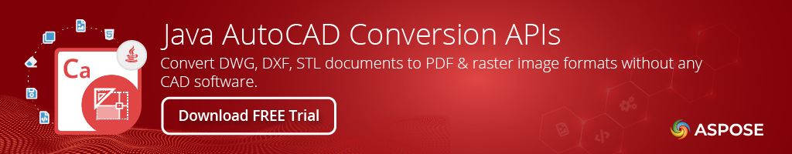

# CAD File Conversion API for Java

[](./)
[Product Page](https://products.aspose.com/cad/java) | [Docs](https://docs.aspose.com/cad/java/) | [Demos](https://products.aspose.app/cad/family) | [API Reference](https://apireference.aspose.com/cad/java) | [Examples](https://github.com/aspose-cad/Aspose.CAD-for-Java) | [Blog](https://blog.aspose.com/category/cad/) | [Search](https://search.aspose.com/) | [Free Support](https://forum.aspose.com/c/cad) | [Temporary License](https://purchase.aspose.com/temporary-license)

[Aspose.CAD for Java](https://products.aspose.com/cad/java) allows developers to export and convert CAD and BIM drawing files like DWG, DXF, DWT, STL, OBJ, DGN, DAE and others to PDF, Vector and Raster images. It is a native API and does not require AutoCAD or any other software to be installed. You can also convert the selected layers and layouts from the CAD files. The conversion to PDF and Raster images is of very high quality.
Please read [release notes for Aspose.CAD Java 24.3](https://releases.aspose.com/cad/java/release-notes/2024/aspose-cad-for-java-24-3-release-notes/) to know what is improved on the latest version.

## CAD File Processing

- [Adjust CAD drawing size](https://docs.aspose.com/cad/java/adjusting-cad-drawing-size/).
- Convert CAD drawings to other file formats.
- [Export 3D AutoCAD Images to PDF](https://docs.aspose.com/cad/java/exporting-cad/).
- Exporting CAD Layouts to PDF.
- Set timeout on save to avoid spending lot of time or consuming a lot of memory.

## Read CAD Formats

**AutoCAD:** DWG, DWT, DWF, DWXF, IFC, PLT\
**MicroStation:** DGN\
**Others:** STL, IGES, CF2, DXB, SVG, CF2

## Save CAD As

**Fixed Layout:** PDF\
**Raster Images:** PNG, BMP, TIFF, JPEG, GIF, PSD, DICOM, WEBP\
**Vector Images** WMF, EMF, SVG

## Read & Write

**CAD:** DXF, DWG, DWT\
**The Advanced Visualizer:** OBJ\
**Others**: STP, OBJ, FBX, U3D, DWF, DWFx
(Write features are partially supported.)

## Supported Environments

- **Microsoft Windows:** Windows Desktop & Server (x86, x64)
- **macOS:** Mac OS X
- **Linux:** Ubuntu, OpenSUSE, CentOS, and others
- **Java Versions:** `J2SE 7.0 (1.7)`, `J2SE 8.0 (1.8)`

## Get Started

Aspose.CAD Java APIs are hosted at the [Aspose Repository](https://releases.aspose.com/cad/java/). You can easily use Aspose.CAD for Java API directly in your Maven projects with simple configurations. For the detailed instructions please visit [Installing Aspose.CAD for Java from Maven Repository](https://docs.aspose.com/cad/java/installation/) documentation page.

## Convert DXF Drawing to PNG Format

```java
Image image = Image.load("template.dxf");

// create an instance of CadRasterizationOptions
CadRasterizationOptions rasterizationOptions = new CadRasterizationOptions();

// set page width & height
rasterizationOptions.setPageWidth(1200);
rasterizationOptions.setPageHeight(1200);

// create an instance of PngOptions for the resultant image
ImageOptionsBase options = new PngOptions();

// set rasterization options
options.setVectorRasterizationOptions(rasterizationOptions);

// save resultant image
image.save("output.png", options);
```

[Product Page](https://products.aspose.com/cad/java) | [Docs](https://docs.aspose.com/cad/java/) | [Demos](https://products.aspose.app/cad/family) | [API Reference](https://apireference.aspose.com/cad/java) | [Examples](https://github.com/aspose-cad/Aspose.CAD-for-Java) | [Blog](https://blog.aspose.com/category/cad/) | [Search](https://search.aspose.com/) | [Free Support](https://forum.aspose.com/c/cad) |  [Temporary License](https://purchase.aspose.com/temporary-license)
