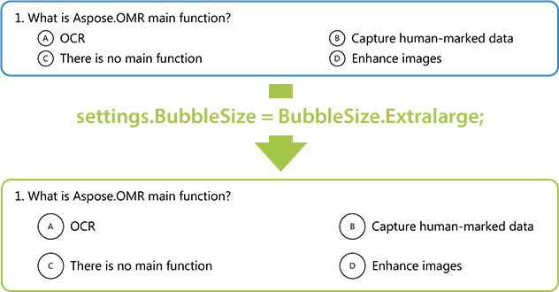

{}
This article contains a summary of recent changes, enhancements and bug fixes in [**Aspose.OMR for Java 23.5.0 (May 2023)**](https://releases.aspose.com/java/repo/com/aspose/aspose-omr/23.5.0/) release.
{}

## What was changed

Key | Summary | Category
--- | ------- | --------
OMRJAVA-75 | Added the ability to set the size of all answer bubbles in the form. | New feature

## Public API changes and backwards compatibility

This section lists all public API changes introduced in **Aspose.OMR for Java 23.5.0** that may affect the code of existing applications.

### Added public APIs:

The following public APIs have been added in this release:

#### `GlobalPageSettings.BubbleSize`

A page layout setting that determines the size of all answer bubbles in the form. Possible values are defined in `BubbleSize` enum.

#### `BubbleSize` enum

Possible sizes of answer bubbles:

Value | Bubble size
----- | -----------
`BubbleSize.Extrasmall` | 40 pixels
`BubbleSize.Small` | 50 pixels
`BubbleSize.Normal` | 60 pixels
`BubbleSize.Large` | 80 pixels
`BubbleSize.Extralarge` | 100 pixels

### Updated public APIs:

_No changes._

### Removed public APIs:

_No changes._

## Usage examples

See the examples below to learn more about the changes introduced in this release:

### Configure the size of all answer bubbles

```java
OmrEngine engine = new OmrEngine();
GlobalPageSettings pageSettings = new GlobalPageSettings();
pageSettings.BubbleSize = BubbleSize.Extralarge;
GenerationResult res = engine.generateTemplate("source.txt", pageSettings);
res.Save("target", "omr_form");
```


