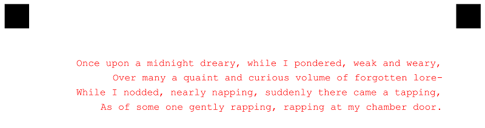

{}
This article contains a summary of recent changes, enhancements and bug fixes in [**Aspose.OMR for Java 24.5.0 (May 2024)**](https://releases.aspose.com/java/repo/com/aspose/aspose-omr/24.5.0/) release.
{}

## What was changed

This is the major release of Aspose.OMR for Java which delivers significant new features, enhancements to existing features, performance improvements, and fixes. The list below contains the most important features that are supported in this release:

Key | Summary | Category
--- | ------- | --------
OMRJAVA-85 | Added the ability to specify color for the text elements | New feature
OMRJAVA-87 | Added the ability to specify horizontal alignment for the text elements | New feature
OMRJAVA-88 | Added the ability to specify color of all text on a page. | New feature
OMRJAVA-29 | Fixed issue with incorrect drawing of image elements with default Height | Fix

## Public API changes and backwards compatibility

This section lists all public API changes introduced in **Aspose.OMR for Java 24.5.0** that may affect the code of existing applications.

### Added public APIs:

The following public APIs have been added in this release:

#### `align` markup property

Specify the horizontal alignment for **text** elements. In case of multiline text elements calculate each line individually. Supported values:

Value | Example
----- | -------
`left` | Align text to the left side of template(default)
`right` | Align text to the right side of template
`center` | Align text to the center of template
text</span>

#### `font_color` markup property

Specify the style for **text** elements. Overrides the font color specified in the page settings. Supports same colors as GlobalPageSettings.

#### `GlobalPageSettings`

`GlobalPageSettings` class allows you to customize the design and layout of the generated OMR form. Starting with **Aspose.OMR for Java 24.5.0**, you can configure the following parameters:

##### `GlobalPageSettings.FontColor`

The new setting `GlobalPageSettings.FontColor` allows you to configure default font color of all elements for the generated OMR form. This setting takes one of the following values:

<table>
<tr><th>Color</th><th>Value</th></tr>
<tr><td>&nbsp;</td><td><code>DrawingColor.undefined</code></td></tr>
<tr><td><div style="width:16px;height:16px;margin-right:8px;border:solid 1px #444444;background-color:AliceBlue;"></div></td><td><code>DrawingColor.AliceBlue</code></td></tr>
<tr><td><div style="width:16px;height:16px;margin-right:8px;border:solid 1px #444444;background-color:AntiqueWhite;"></div></td><td><code>DrawingColor.AntiqueWhite</code></td></tr>
<tr><td><div style="width:16px;height:16px;margin-right:8px;border:solid 1px #444444;background-color:Aqua;"></div></td><td><code>DrawingColor.Aqua</code></td></tr>
<tr><td><div style="width:16px;height:16px;margin-right:8px;border:solid 1px #444444;background-color:Aquamarine;"></div></td><td><code>DrawingColor.Aquamarine</code></td></tr>
<tr><td><div style="width:16px;height:16px;margin-right:8px;border:solid 1px #444444;background-color:Azure;"></div></td><td><code>DrawingColor.Azure</code></td></tr>
<tr><td><div style="width:16px;height:16px;margin-right:8px;border:solid 1px #444444;background-color:Beige;"></div></td><td><code>DrawingColor.Beige</code></td></tr>
<tr><td><div style="width:16px;height:16px;margin-right:8px;border:solid 1px #444444;background-color:Bisque;"></div></td><td><code>DrawingColor.Bisque</code></td></tr>
<tr><td><div style="width:16px;height:16px;margin-right:8px;border:solid 1px #444444;background-color:Black;"></div></td><td><code>DrawingColor.Black</code></td></tr>
<tr><td><div style="width:16px;height:16px;margin-right:8px;border:solid 1px #444444;background-color:BlanchedAlmond;"></div></td><td><code>DrawingColor.BlanchedAlmond</code></td></tr>
<tr><td><div style="width:16px;height:16px;margin-right:8px;border:solid 1px #444444;background-color:Blue;"></div></td><td><code>DrawingColor.Blue</code></td></tr>
<tr><td><div style="width:16px;height:16px;margin-right:8px;border:solid 1px #444444;background-color:BlueViolet;"></div></td><td><code>DrawingColor.BlueViolet</code></td></tr>
<tr><td><div style="width:16px;height:16px;margin-right:8px;border:solid 1px #444444;background-color:Brown;"></div></td><td><code>DrawingColor.Brown</code></td></tr>
<tr><td><div style="width:16px;height:16px;margin-right:8px;border:solid 1px #444444;background-color:BurlyWood;"></div></td><td><code>DrawingColor.BurlyWood</code></td></tr>
<tr><td><div style="width:16px;height:16px;margin-right:8px;border:solid 1px #444444;background-color:CadetBlue;"></div></td><td><code>DrawingColor.CadetBlue</code></td></tr>
<tr><td><div style="width:16px;height:16px;margin-right:8px;border:solid 1px #444444;background-color:Chartreuse;"></div></td><td><code>DrawingColor.Chartreuse</code></td></tr>
<tr><td><div style="width:16px;height:16px;margin-right:8px;border:solid 1px #444444;background-color:Chocolate;"></div></td><td><code>DrawingColor.Chocolate</code></td></tr>
<tr><td><div style="width:16px;height:16px;margin-right:8px;border:solid 1px #444444;background-color:Coral;"></div></td><td><code>DrawingColor.Coral</code></td></tr>
<tr><td><div style="width:16px;height:16px;margin-right:8px;border:solid 1px #444444;background-color:CornflowerBlue;"></div></td><td><code>DrawingColor.CornflowerBlue</code></td></tr>
<tr><td><div style="width:16px;height:16px;margin-right:8px;border:solid 1px #444444;background-color:Cornsilk;"></div></td><td><code>DrawingColor.Cornsilk</code></td></tr>
<tr><td><div style="width:16px;height:16px;margin-right:8px;border:solid 1px #444444;background-color:Crimson;"></div></td><td><code>DrawingColor.Crimson</code></td></tr>
<tr><td><div style="width:16px;height:16px;margin-right:8px;border:solid 1px #444444;background-color:Cyan;"></div></td><td><code>DrawingColor.Cyan</code></td></tr>
<tr><td><div style="width:16px;height:16px;margin-right:8px;border:solid 1px #444444;background-color:DarkBlue;"></div></td><td><code>DrawingColor.DarkBlue</code></td></tr>
<tr><td><div style="width:16px;height:16px;margin-right:8px;border:solid 1px #444444;background-color:DarkCyan;"></div></td><td><code>DrawingColor.DarkCyan</code></td></tr>
<tr><td><div style="width:16px;height:16px;margin-right:8px;border:solid 1px #444444;background-color:DarkGoldenrod;"></div></td><td><code>DrawingColor.DarkGoldenrod</code></td></tr>
<tr><td><div style="width:16px;height:16px;margin-right:8px;border:solid 1px #444444;background-color:DarkGray;"></div></td><td><code>DrawingColor.DarkGray</code></td></tr>
<tr><td><div style="width:16px;height:16px;margin-right:8px;border:solid 1px #444444;background-color:DarkGreen;"></div></td><td><code>DrawingColor.DarkGreen</code></td></tr>
<tr><td><div style="width:16px;height:16px;margin-right:8px;border:solid 1px #444444;background-color:DarkKhaki;"></div></td><td><code>DrawingColor.DarkKhaki</code></td></tr>
<tr><td><div style="width:16px;height:16px;margin-right:8px;border:solid 1px #444444;background-color:DarkMagenta;"></div></td><td><code>DrawingColor.DarkMagenta</code></td></tr>
<tr><td><div style="width:16px;height:16px;margin-right:8px;border:solid 1px #444444;background-color:DarkOliveGreen;"></div></td><td><code>DrawingColor.DarkOliveGreen</code></td></tr>
<tr><td><div style="width:16px;height:16px;margin-right:8px;border:solid 1px #444444;background-color:DarkOrange;"></div></td><td><code>DrawingColor.DarkOrange</code></td></tr>
<tr><td><div style="width:16px;height:16px;margin-right:8px;border:solid 1px #444444;background-color:DarkOrchid;"></div></td><td><code>DrawingColor.DarkOrchid</code></td></tr>
<tr><td><div style="width:16px;height:16px;margin-right:8px;border:solid 1px #444444;background-color:DarkRed;"></div></td><td><code>DrawingColor.DarkRed</code></td></tr>
<tr><td><div style="width:16px;height:16px;margin-right:8px;border:solid 1px #444444;background-color:DarkSalmon;"></div></td><td><code>DrawingColor.DarkSalmon</code></td></tr>
<tr><td><div style="width:16px;height:16px;margin-right:8px;border:solid 1px #444444;background-color:DarkSeaGreen;"></div></td><td><code>DrawingColor.DarkSeaGreen</code></td></tr>
<tr><td><div style="width:16px;height:16px;margin-right:8px;border:solid 1px #444444;background-color:DarkSlateBlue;"></div></td><td><code>DrawingColor.DarkSlateBlue</code></td></tr>
<tr><td><div style="width:16px;height:16px;margin-right:8px;border:solid 1px #444444;background-color:DarkSlateGray;"></div></td><td><code>DrawingColor.DarkSlateGray</code></td></tr>
<tr><td><div style="width:16px;height:16px;margin-right:8px;border:solid 1px #444444;background-color:DarkTurquoise;"></div></td><td><code>DrawingColor.DarkTurquoise</code></td></tr>
<tr><td><div style="width:16px;height:16px;margin-right:8px;border:solid 1px #444444;background-color:DarkViolet;"></div></td><td><code>DrawingColor.DarkViolet</code></td></tr>
<tr><td><div style="width:16px;height:16px;margin-right:8px;border:solid 1px #444444;background-color:DeepPink;"></div></td><td><code>DrawingColor.DeepPink</code></td></tr>
<tr><td><div style="width:16px;height:16px;margin-right:8px;border:solid 1px #444444;background-color:DeepSkyBlue;"></div></td><td><code>DrawingColor.DeepSkyBlue</code></td></tr>
<tr><td><div style="width:16px;height:16px;margin-right:8px;border:solid 1px #444444;background-color:DimGray;"></div></td><td><code>DrawingColor.DimGray</code></td></tr>
<tr><td><div style="width:16px;height:16px;margin-right:8px;border:solid 1px #444444;background-color:DodgerBlue;"></div></td><td><code>DrawingColor.DodgerBlue</code></td></tr>
<tr><td><div style="width:16px;height:16px;margin-right:8px;border:solid 1px #444444;background-color:Firebrick;"></div></td><td><code>DrawingColor.Firebrick</code></td></tr>
<tr><td><div style="width:16px;height:16px;margin-right:8px;border:solid 1px #444444;background-color:FloralWhite;"></div></td><td><code>DrawingColor.FloralWhite</code></td></tr>
<tr><td><div style="width:16px;height:16px;margin-right:8px;border:solid 1px #444444;background-color:ForestGreen;"></div></td><td><code>DrawingColor.ForestGreen</code></td></tr>
<tr><td><div style="width:16px;height:16px;margin-right:8px;border:solid 1px #444444;background-color:Fuchsia;"></div></td><td><code>DrawingColor.Fuchsia</code></td></tr>
<tr><td><div style="width:16px;height:16px;margin-right:8px;border:solid 1px #444444;background-color:Gainsboro;"></div></td><td><code>DrawingColor.Gainsboro</code></td></tr>
<tr><td><div style="width:16px;height:16px;margin-right:8px;border:solid 1px #444444;background-color:GhostWhite;"></div></td><td><code>DrawingColor.GhostWhite</code></td></tr>
<tr><td><div style="width:16px;height:16px;margin-right:8px;border:solid 1px #444444;background-color:Gold;"></div></td><td><code>DrawingColor.Gold</code></td></tr>
<tr><td><div style="width:16px;height:16px;margin-right:8px;border:solid 1px #444444;background-color:Goldenrod;"></div></td><td><code>DrawingColor.Goldenrod</code></td></tr>
<tr><td><div style="width:16px;height:16px;margin-right:8px;border:solid 1px #444444;background-color:Gray;"></div></td><td><code>DrawingColor.Gray</code></td></tr>
<tr><td><div style="width:16px;height:16px;margin-right:8px;border:solid 1px #444444;background-color:Green;"></div></td><td><code>DrawingColor.Green</code></td></tr>
<tr><td><div style="width:16px;height:16px;margin-right:8px;border:solid 1px #444444;background-color:GreenYellow;"></div></td><td><code>DrawingColor.GreenYellow</code></td></tr>
<tr><td><div style="width:16px;height:16px;margin-right:8px;border:solid 1px #444444;background-color:Honeydew;"></div></td><td><code>DrawingColor.Honeydew</code></td></tr>
<tr><td><div style="width:16px;height:16px;margin-right:8px;border:solid 1px #444444;background-color:HotPink;"></div></td><td><code>DrawingColor.HotPink</code></td></tr>
<tr><td><div style="width:16px;height:16px;margin-right:8px;border:solid 1px #444444;background-color:IndianRed;"></div></td><td><code>DrawingColor.IndianRed</code></td></tr>
<tr><td><div style="width:16px;height:16px;margin-right:8px;border:solid 1px #444444;background-color:Indigo;"></div></td><td><code>DrawingColor.Indigo</code></td></tr>
<tr><td><div style="width:16px;height:16px;margin-right:8px;border:solid 1px #444444;background-color:Ivory;"></div></td><td><code>DrawingColor.Ivory</code></td></tr>
<tr><td><div style="width:16px;height:16px;margin-right:8px;border:solid 1px #444444;background-color:Khaki;"></div></td><td><code>DrawingColor.Khaki</code></td></tr>
<tr><td><div style="width:16px;height:16px;margin-right:8px;border:solid 1px #444444;background-color:Lavender;"></div></td><td><code>DrawingColor.Lavender</code></td></tr>
<tr><td><div style="width:16px;height:16px;margin-right:8px;border:solid 1px #444444;background-color:LavenderBlush;"></div></td><td><code>DrawingColor.LavenderBlush</code></td></tr>
<tr><td><div style="width:16px;height:16px;margin-right:8px;border:solid 1px #444444;background-color:LawnGreen;"></div></td><td><code>DrawingColor.LawnGreen</code></td></tr>
<tr><td><div style="width:16px;height:16px;margin-right:8px;border:solid 1px #444444;background-color:LemonChiffon;"></div></td><td><code>DrawingColor.LemonChiffon</code></td></tr>
<tr><td><div style="width:16px;height:16px;margin-right:8px;border:solid 1px #444444;background-color:LightBlue;"></div></td><td><code>DrawingColor.LightBlue</code></td></tr>
<tr><td><div style="width:16px;height:16px;margin-right:8px;border:solid 1px #444444;background-color:LightCoral;"></div></td><td><code>DrawingColor.LightCoral</code></td></tr>
<tr><td><div style="width:16px;height:16px;margin-right:8px;border:solid 1px #444444;background-color:LightCyan;"></div></td><td><code>DrawingColor.LightCyan</code></td></tr>
<tr><td><div style="width:16px;height:16px;margin-right:8px;border:solid 1px #444444;background-color:LightGoldenrodYellow;"></div></td><td><code>DrawingColor.LightGoldenrodYellow</code></td></tr>
<tr><td><div style="width:16px;height:16px;margin-right:8px;border:solid 1px #444444;background-color:LightGray;"></div></td><td><code>DrawingColor.LightGray</code></td></tr>
<tr><td><div style="width:16px;height:16px;margin-right:8px;border:solid 1px #444444;background-color:LightGreen;"></div></td><td><code>DrawingColor.LightGreen</code></td></tr>
<tr><td><div style="width:16px;height:16px;margin-right:8px;border:solid 1px #444444;background-color:LightPink;"></div></td><td><code>DrawingColor.LightPink</code></td></tr>
<tr><td><div style="width:16px;height:16px;margin-right:8px;border:solid 1px #444444;background-color:LightSalmon;"></div></td><td><code>DrawingColor.LightSalmon</code></td></tr>
<tr><td><div style="width:16px;height:16px;margin-right:8px;border:solid 1px #444444;background-color:LightSeaGreen;"></div></td><td><code>DrawingColor.LightSeaGreen</code></td></tr>
<tr><td><div style="width:16px;height:16px;margin-right:8px;border:solid 1px #444444;background-color:LightSkyBlue;"></div></td><td><code>DrawingColor.LightSkyBlue</code></td></tr>
<tr><td><div style="width:16px;height:16px;margin-right:8px;border:solid 1px #444444;background-color:LightSlateGray;"></div></td><td><code>DrawingColor.LightSlateGray</code></td></tr>
<tr><td><div style="width:16px;height:16px;margin-right:8px;border:solid 1px #444444;background-color:LightSteelBlue;"></div></td><td><code>DrawingColor.LightSteelBlue</code></td></tr>
<tr><td><div style="width:16px;height:16px;margin-right:8px;border:solid 1px #444444;background-color:LightYellow;"></div></td><td><code>DrawingColor.LightYellow</code></td></tr>
<tr><td><div style="width:16px;height:16px;margin-right:8px;border:solid 1px #444444;background-color:Lime;"></div></td><td><code>DrawingColor.Lime</code></td></tr>
<tr><td><div style="width:16px;height:16px;margin-right:8px;border:solid 1px #444444;background-color:LimeGreen;"></div></td><td><code>DrawingColor.LimeGreen</code></td></tr>
<tr><td><div style="width:16px;height:16px;margin-right:8px;border:solid 1px #444444;background-color:Linen;"></div></td><td><code>DrawingColor.Linen</code></td></tr>
<tr><td><div style="width:16px;height:16px;margin-right:8px;border:solid 1px #444444;background-color:Magenta;"></div></td><td><code>DrawingColor.Magenta</code></td></tr>
<tr><td><div style="width:16px;height:16px;margin-right:8px;border:solid 1px #444444;background-color:Maroon;"></div></td><td><code>DrawingColor.Maroon</code></td></tr>
<tr><td><div style="width:16px;height:16px;margin-right:8px;border:solid 1px #444444;background-color:MediumAquamarine;"></div></td><td><code>DrawingColor.MediumAquamarine</code></td></tr>
<tr><td><div style="width:16px;height:16px;margin-right:8px;border:solid 1px #444444;background-color:MediumBlue;"></div></td><td><code>DrawingColor.MediumBlue</code></td></tr>
<tr><td><div style="width:16px;height:16px;margin-right:8px;border:solid 1px #444444;background-color:MediumOrchid;"></div></td><td><code>DrawingColor.MediumOrchid</code></td></tr>
<tr><td><div style="width:16px;height:16px;margin-right:8px;border:solid 1px #444444;background-color:MediumPurple;"></div></td><td><code>DrawingColor.MediumPurple</code></td></tr>
<tr><td><div style="width:16px;height:16px;margin-right:8px;border:solid 1px #444444;background-color:MediumSeaGreen;"></div></td><td><code>DrawingColor.MediumSeaGreen</code></td></tr>
<tr><td><div style="width:16px;height:16px;margin-right:8px;border:solid 1px #444444;background-color:MediumSlateBlue;"></div></td><td><code>DrawingColor.MediumSlateBlue</code></td></tr>
<tr><td><div style="width:16px;height:16px;margin-right:8px;border:solid 1px #444444;background-color:MediumSpringGreen;"></div></td><td><code>DrawingColor.MediumSpringGreen</code></td></tr>
<tr><td><div style="width:16px;height:16px;margin-right:8px;border:solid 1px #444444;background-color:MediumTurquoise;"></div></td><td><code>DrawingColor.MediumTurquoise</code></td></tr>
<tr><td><div style="width:16px;height:16px;margin-right:8px;border:solid 1px #444444;background-color:MediumVioletRed;"></div></td><td><code>DrawingColor.MediumVioletRed</code></td></tr>
<tr><td><div style="width:16px;height:16px;margin-right:8px;border:solid 1px #444444;background-color:MidnightBlue;"></div></td><td><code>DrawingColor.MidnightBlue</code></td></tr>
<tr><td><div style="width:16px;height:16px;margin-right:8px;border:solid 1px #444444;background-color:MintCream;"></div></td><td><code>DrawingColor.MintCream</code></td></tr>
<tr><td><div style="width:16px;height:16px;margin-right:8px;border:solid 1px #444444;background-color:MistyRose;"></div></td><td><code>DrawingColor.MistyRose</code></td></tr>
<tr><td><div style="width:16px;height:16px;margin-right:8px;border:solid 1px #444444;background-color:Moccasin;"></div></td><td><code>DrawingColor.Moccasin</code></td></tr>
<tr><td><div style="width:16px;height:16px;margin-right:8px;border:solid 1px #444444;background-color:NavajoWhite;"></div></td><td><code>DrawingColor.NavajoWhite</code></td></tr>
<tr><td><div style="width:16px;height:16px;margin-right:8px;border:solid 1px #444444;background-color:Navy;"></div></td><td><code>DrawingColor.Navy</code></td></tr>
<tr><td><div style="width:16px;height:16px;margin-right:8px;border:solid 1px #444444;background-color:OldLace;"></div></td><td><code>DrawingColor.OldLace</code></td></tr>
<tr><td><div style="width:16px;height:16px;margin-right:8px;border:solid 1px #444444;background-color:Olive;"></div></td><td><code>DrawingColor.Olive</code></td></tr>
<tr><td><div style="width:16px;height:16px;margin-right:8px;border:solid 1px #444444;background-color:OliveDrab;"></div></td><td><code>DrawingColor.OliveDrab</code></td></tr>
<tr><td><div style="width:16px;height:16px;margin-right:8px;border:solid 1px #444444;background-color:Orange;"></div></td><td><code>DrawingColor.Orange</code></td></tr>
<tr><td><div style="width:16px;height:16px;margin-right:8px;border:solid 1px #444444;background-color:OrangeRed;"></div></td><td><code>DrawingColor.OrangeRed</code></td></tr>
<tr><td><div style="width:16px;height:16px;margin-right:8px;border:solid 1px #444444;background-color:Orchid;"></div></td><td><code>DrawingColor.Orchid</code></td></tr>
<tr><td><div style="width:16px;height:16px;margin-right:8px;border:solid 1px #444444;background-color:PaleGoldenrod;"></div></td><td><code>DrawingColor.PaleGoldenrod</code></td></tr>
<tr><td><div style="width:16px;height:16px;margin-right:8px;border:solid 1px #444444;background-color:PaleGreen;"></div></td><td><code>DrawingColor.PaleGreen</code></td></tr>
<tr><td><div style="width:16px;height:16px;margin-right:8px;border:solid 1px #444444;background-color:PaleTurquoise;"></div></td><td><code>DrawingColor.PaleTurquoise</code></td></tr>
<tr><td><div style="width:16px;height:16px;margin-right:8px;border:solid 1px #444444;background-color:PaleVioletRed;"></div></td><td><code>DrawingColor.PaleVioletRed</code></td></tr>
<tr><td><div style="width:16px;height:16px;margin-right:8px;border:solid 1px #444444;background-color:PapayaWhip;"></div></td><td><code>DrawingColor.PapayaWhip</code></td></tr>
<tr><td><div style="width:16px;height:16px;margin-right:8px;border:solid 1px #444444;background-color:PeachPuff;"></div></td><td><code>DrawingColor.PeachPuff</code></td></tr>
<tr><td><div style="width:16px;height:16px;margin-right:8px;border:solid 1px #444444;background-color:Peru;"></div></td><td><code>DrawingColor.Peru</code></td></tr>
<tr><td><div style="width:16px;height:16px;margin-right:8px;border:solid 1px #444444;background-color:Pink;"></div></td><td><code>DrawingColor.Pink</code></td></tr>
<tr><td><div style="width:16px;height:16px;margin-right:8px;border:solid 1px #444444;background-color:Plum;"></div></td><td><code>DrawingColor.Plum</code></td></tr>
<tr><td><div style="width:16px;height:16px;margin-right:8px;border:solid 1px #444444;background-color:PowderBlue;"></div></td><td><code>DrawingColor.PowderBlue</code></td></tr>
<tr><td><div style="width:16px;height:16px;margin-right:8px;border:solid 1px #444444;background-color:Purple;"></div></td><td><code>DrawingColor.Purple</code></td></tr>
<tr><td><div style="width:16px;height:16px;margin-right:8px;border:solid 1px #444444;background-color:Red;"></div></td><td><code>DrawingColor.Red</code></td></tr>
<tr><td><div style="width:16px;height:16px;margin-right:8px;border:solid 1px #444444;background-color:RosyBrown;"></div></td><td><code>DrawingColor.RosyBrown</code></td></tr>
<tr><td><div style="width:16px;height:16px;margin-right:8px;border:solid 1px #444444;background-color:RoyalBlue;"></div></td><td><code>DrawingColor.RoyalBlue</code></td></tr>
<tr><td><div style="width:16px;height:16px;margin-right:8px;border:solid 1px #444444;background-color:SaddleBrown;"></div></td><td><code>DrawingColor.SaddleBrown</code></td></tr>
<tr><td><div style="width:16px;height:16px;margin-right:8px;border:solid 1px #444444;background-color:Salmon;"></div></td><td><code>DrawingColor.Salmon</code></td></tr>
<tr><td><div style="width:16px;height:16px;margin-right:8px;border:solid 1px #444444;background-color:SandyBrown;"></div></td><td><code>DrawingColor.SandyBrown</code></td></tr>
<tr><td><div style="width:16px;height:16px;margin-right:8px;border:solid 1px #444444;background-color:SeaGreen;"></div></td><td><code>DrawingColor.SeaGreen</code></td></tr>
<tr><td><div style="width:16px;height:16px;margin-right:8px;border:solid 1px #444444;background-color:SeaShell;"></div></td><td><code>DrawingColor.SeaShell</code></td></tr>
<tr><td><div style="width:16px;height:16px;margin-right:8px;border:solid 1px #444444;background-color:Sienna;"></div></td><td><code>DrawingColor.Sienna</code></td></tr>
<tr><td><div style="width:16px;height:16px;margin-right:8px;border:solid 1px #444444;background-color:Silver;"></div></td><td><code>DrawingColor.Silver</code></td></tr>
<tr><td><div style="width:16px;height:16px;margin-right:8px;border:solid 1px #444444;background-color:SkyBlue;"></div></td><td><code>DrawingColor.SkyBlue</code></td></tr>
<tr><td><div style="width:16px;height:16px;margin-right:8px;border:solid 1px #444444;background-color:SlateBlue;"></div></td><td><code>DrawingColor.SlateBlue</code></td></tr>
<tr><td><div style="width:16px;height:16px;margin-right:8px;border:solid 1px #444444;background-color:SlateGray;"></div></td><td><code>DrawingColor.SlateGray</code></td></tr>
<tr><td><div style="width:16px;height:16px;margin-right:8px;border:solid 1px #444444;background-color:Snow;"></div></td><td><code>DrawingColor.Snow</code></td></tr>
<tr><td><div style="width:16px;height:16px;margin-right:8px;border:solid 1px #444444;background-color:SpringGreen;"></div></td><td><code>DrawingColor.SpringGreen</code></td></tr>
<tr><td><div style="width:16px;height:16px;margin-right:8px;border:solid 1px #444444;background-color:SteelBlue;"></div></td><td><code>DrawingColor.SteelBlue</code></td></tr>
<tr><td><div style="width:16px;height:16px;margin-right:8px;border:solid 1px #444444;background-color:Tan;"></div></td><td><code>DrawingColor.Tan</code></td></tr>
<tr><td><div style="width:16px;height:16px;margin-right:8px;border:solid 1px #444444;background-color:Teal;"></div></td><td><code>DrawingColor.Teal</code></td></tr>
<tr><td><div style="width:16px;height:16px;margin-right:8px;border:solid 1px #444444;background-color:Thistle;"></div></td><td><code>DrawingColor.Thistle</code></td></tr>
<tr><td><div style="width:16px;height:16px;margin-right:8px;border:solid 1px #444444;background-color:Tomato;"></div></td><td><code>DrawingColor.Tomato</code></td></tr>
<tr><td><div style="width:16px;height:16px;margin-right:8px;border:solid 1px #444444;background-color:Turquoise;"></div></td><td><code>DrawingColor.Turquoise</code></td></tr>
<tr><td><div style="width:16px;height:16px;margin-right:8px;border:solid 1px #444444;background-color:Violet;"></div></td><td><code>DrawingColor.Violet</code></td></tr>
<tr><td><div style="width:16px;height:16px;margin-right:8px;border:solid 1px #444444;background-color:Wheat;"></div></td><td><code>DrawingColor.Wheat</code></td></tr>
<tr><td><div style="width:16px;height:16px;margin-right:8px;border:solid 1px #444444;background-color:White;"></div></td><td><code>DrawingColor.White</code></td></tr>
<tr><td><div style="width:16px;height:16px;margin-right:8px;border:solid 1px #444444;background-color:WhiteSmoke;"></div></td><td><code>DrawingColor.WhiteSmoke</code></td></tr>
<tr><td><div style="width:16px;height:16px;margin-right:8px;border:solid 1px #444444;background-color:Yellow;"></div></td><td><code>DrawingColor.Yellow</code></td></tr>
<tr><td><div style="width:16px;height:16px;margin-right:8px;border:solid 1px #444444;background-color:YellowGreen;"></div></td><td><code>DrawingColor.YellowGreen</code></td></tr>
</table>

### Updated public APIs:

_No changes._

### Removed public APIs:

_No changes._

## Usage examples

See the examples below to learn more about the changes introduced in this release:

### Configure default font color of the OMR form

```java
OmrEngine engine = new OmrEngine();
GlobalPageSettings pageSettings = new GlobalPageSettings();
pageSettings.FontColor = DrawingColor.Red;
GenerationResult res = engine.generateTemplate("source.txt", pageSettings);
res.Save("target", "omr_form");
```

### Set color for the text element

### Configure the style of text elements

```text
?text=Once upon a midnight dreary, while I pondered, weak and weary,
Over many a quaint and curious volume of forgotten lore-
While I nodded, nearly napping, suddenly there came a tapping,
As of some one gently rapping, rapping at my chamber door.
	font_family=Courier New
	font_style=bold, italic
	font_size=16
	font_color=Red
	align=right
```


