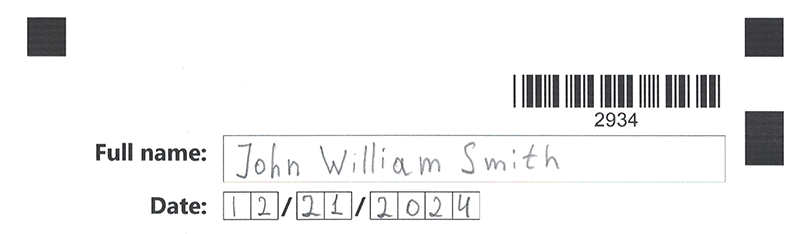

{}
This article contains a summary of recent changes, enhancements and bug fixes in [**Aspose.OMR for .NET Handwriting plugin 24.7.0 (July 2024)**](https://www.nuget.org/packages/Aspose.OMR.Handwriting) release.
{}

## What was changed

Key | Summary | Category
--- | ------- | --------
OMRNET&#8209;1021 | Added a new element that allows users to enter handwritten text in a free-form manner. | New feature

## Public API changes and backwards compatibility

This section lists all public API changes introduced in **Aspose.OMR for .NET Handwriting plugin 24.7.0** that may affect the code of existing applications.

### Added public APIs:

The following public APIs have been added to Aspose.OMR for .NET Handwriting plugin 24.7.0:

#### `free_text_input` text markup element

This element adds a handwritten text placeholder to the form. The placeholder allows the respondent to write a line of text in a free manner. The handwritten text is recognized automatically without the need for an external OCR library.

The element is declared with `?free_text_input=[name]` statement. This statement must be placed on a separate line. See [Text markup](https://docs.aspose.com/omr/txt-markup/) for more information.

`name` property is returned in the recognition results as an answer ID and also used as a reminder of the element’s purpose in form’s source code; for example, _FullName_. This is an optional property - you can use the same name for multiple elements or just omit it. The name is not displayed on the form.

The `free_text_input` element height can be optionally adjusted by adding `line_height=[element height in pixels]` attribute on a new line immediately after the opening `?free_text_input=` statement. The attribute declaration must begin with a tab character.

#### `free_text_input` JSON markup element

This element adds a handwritten text placeholder to the form. The placeholder allows the respondent to write a line of text in a free manner. The handwritten text is recognized automatically without the need for an external OCR library.

The element is declared as an object with `"element_type": "text_input"` property. See [JSON markup](https://docs.aspose.com/omr/json-markup/examples/) for more information.

**Optional properties:**

Name | Type | Description
---- | ---- | -----------
`name` | string | Used as a reminder of the element’s purpose in the form's source code and returned as an identifier of the recognition result.<br />You can use the same value for multiple elements. This text is not displayed on the form.
`line_height` | number | The height of an element, in pixels.


#### `Aspose.OMR.Handwriting.Generation.Config.Elements.FreeTextInputConfig` class

This element adds a handwritten text placeholder to the form. The placeholder allows the respondent to write a line of text in a free manner. The handwritten text is recognized automatically without the need for an external OCR library.

**Object properties:**

Name | Type | Description
---- | ---- | -----------
`Name` | `string` | Used as a reminder of the element’s purpose in the source code and returned as an identifier of the recognition result.<br />You can use the same value for multiple elements. This text is not displayed on the form.
`LineHeight` | `int` | The height of an element, in pixels.

### Updated public APIs:

_No changes_

### Removed public APIs:

_No changes_

## Usage examples

See the examples below to learn more about the changes introduced in **Aspose.OMR for .NET Handwriting plugin 24.7.0**.

### Before you begin

To achieve the best results with free-form text input, consider these requirements and limitations.

- The response must fit one line. Multi-line texts are not supported.
- The handwritten characters must be written as close to typed characters as possible.  
  
- Write characters separately, resembling typed letters, and clearly space words.
- Only English characters are supported.

### Add free-form handwritten text element

```
?container=Example
?block=
	border=square
	border_size=3
?free_text_input=FullName
	line_height=100
&block
&container
```


