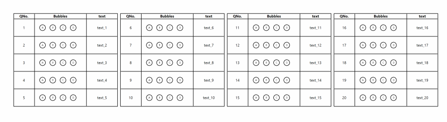

{}
This article contains a summary of recent changes, enhancements and bug fixes in [**Aspose.OMR for .NET 25.4.0 (March 2025)**](https://www.nuget.org/packages/Aspose.OMR/25.4.0) release.
{}

## What was changed

Key | Summary | Category
--- | ------- | --------
OMRNET&#8209;1121 | Added threshold, height, vertical_padding and horizontal_padding properties for CustomAnswerSheet's BubbleArray element.  | New feature
OMRNET&#8209;1121 | Fixed incorrect display of bubbles in UI wrapper(CorrectionUI). | Fix
OMRNET&#8209;1121 | Fixed issue with generation of non-western digits in CustomAnswerSheet's rows. | Fix

## Public API changes and backwards compatibility

This section lists all public API changes introduced in **Aspose.OMR for .NET 25.4.0** that may affect the code of existing applications.

### Added public APIs:

The following public APIs have been added to Aspose.OMR for .NET 25.4.0:


##### `Aspose.OMR.Generation.Config.Elements.CustomAnswerSheet.BubbleArrayConfig.Height` property
##### `height` text markup attribute for `bubble_array`
##### `height` JSON markup attribute for `BubbleArray`
Overrides height of bubble array row. Set in pixels.
Partially visible or overflowing content will be removed. 
Default value is -1. By default  height of the bubble array will be scaled automatically.        

###### `Aspose.OMR.Generation.Config.Elements.CustomAnswerSheet.BubbleArrayConfig.Threshold` property
###### `threshold` text markup attribute for `bubble_array`
###### `threshold` JSON markup attribute for `BubbleArray`
Override global threshold provided during recognition for bubbles in this array.
Integer represent percent of pixels from 0 to 100 after which bubbles considered marked.
Default value is -1. By default global value of threshold will be used.

###### `Aspose.OMR.Generation.Config.Elements.CustomAnswerSheet.BubbleArrayConfig.VerticalPadding` property
###### `vertical_padding` text markup attribute for `bubble_array`
###### `vertical_padding` JSON markup attribute for `BubbleArray`
Number of additional pixels on top and bottom sides inside bubble row
Default value is 0.

###### `Aspose.OMR.Generation.Config.Elements.CustomAnswerSheet.BubbleArrayConfig.HorizontalPadding` property 
###### `horizontal_padding` text markup attribute for `bubble_array` 
###### `horizontal_padding` JSON markup attribute for `BubbleArray` 
Number of additional pixels on left and right sides inside bubble row
Default value is 0

### Updated public APIs:

_No changes._

### Removed public APIs:

_No changes._

## Usage examples

See the examples below to learn more about the changes introduced in this release:

### Customizing bubble array

```text
?custom_answer_sheet=PART 1
	section_border=square
	amount=20
	columns_count=4	
	row_proportions=20%-50%-30%
?header=123
?column=QNo.
	font_size=6
	font_style=bold
	align=center
?column=Bubbles
	font_size=6
	font_style=bold
	align=center
?column=text
	font_size=6
	font_style=bold
	align=center
&header
?custom_row=row_%index%
?content=%index%
	font_size=6
	align=center
?bubble_array=b_%index%
	answers_list=(A)(B)(C)(D)(E)(F)(G)(H)(I)(G)(K)(L)
	bubble_size=extrasmall
	font_size=4
	threshold=70
	height=120
	vertical_padding=20
	horizontal_padding=20
?content=text_%index%
	font_size=6
	align=center
&custom_row
&custom_answer_sheet
```
{}
Please notice, that bubbles from "E" to "L" are clipped.
They will not be displayed at the generated template and will not participate in recognition process.
{} 

