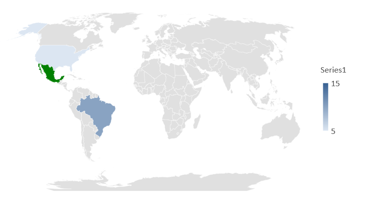

{}

This page contains release notes for Aspose.Slides for C++ 20.11.

{}

## **Supported Platforms**
- Aspose.Slides for C++ for Windows x64 (Microsoft Visual C++).
- Aspose.Slides for C++ for Windows x86 (Microsoft Visual C++).
- Aspose.Slides for C++ for Linux (Clang).

## **New Features and Enhancements**
|**Key**|**Summary**|**Category**|
| :- | :- | :- |
|SLIDESNET-36008|Support to verify the presentation password|Feature|
|SLIDESNET-42201|Ability to test presentation password to open|Feature|
|SLIDESNET-38917|Ability to test presentation password to modify|Feature|
|SLIDESNET-42020|Support for Map type chart in Aspose.Slides|Feature|

## **Other Improvements and Changes**
|**Key**|**Summary**|**Category**|
| :- | :- | :- |
|SLIDESCPP-2412|Use Aspose.Slides for .NET 20.11 features|Enhancement|
|SLIDESCPP-2652|Support Aspose.Slides for C++ library for x86 platform|Enhancement|
|SLIDESCPP-2653|Improve font handling in Linux environment (20.11)|Enhancement|

## **Public API Changes**
### Checking password to open via IPresentationInfo interface
**[CheckPassword](https://reference.aspose.com/slides/cpp/class/aspose.slides.i_presentation_info#a6f6d9c697959913eb8e239bf8254a475)**
method has been added to **[IPresentationInfo](https://reference.aspose.com/slides/cpp/class/aspose.slides.i_presentation_info)**
interface and **[PresentationInfo](https://reference.aspose.com/slides/cpp/class/aspose.slides.presentation_info)** class.
This method allows checking whether a presentation is protected by a password to open.

Method declaration:
```cpp
/// <summary>
/// Checks whether a password is correct for a presentation protected with open password.
/// </summary>
/// <param name="password">The password to check.</param>
/// <returns>
/// True if the presentation is protected with open password and the password is correct and false otherwise.
/// </returns>
/// <remarks>
/// When the password is null or empty, this method returns false.
/// </remarks>
virtual bool CheckPassword(System::String password) = 0;
```

The example below demonstrates how to check a password to open a presentation:
```cpp
auto info = PresentationFactory::get_Instance()->GetPresentationInfo(u"pres.pptx");
bool isPasswordCorrect = info->CheckPassword(u"my_password");
```

### get_KeepTextFlat() and set_KeepTextFlat() methods have been added to ITextFrameFormat interface
New methods **[get_KeepTextFlat()](https://reference.aspose.com/slides/cpp/class/aspose.slides.i_text_frame_format#ae4cb35f31bd5b1e1e589ca3ec62b59bd)**
and **[set_KeepTextFlat()](https://reference.aspose.com/slides/cpp/class/aspose.slides.i_text_frame_format#abcb0a0243ca69aa29704fe4072577651)**
have been added to **[ITextFrameFormat](https://reference.aspose.com/slides/cpp/class/aspose.slides.i_text_frame_format)** interface.

Using this property allows to keep text out of 3D scene entirely.

Property declaration:

```cpp
/// <summary>
/// Returns or set keeping text out of 3D scene entirely.
/// Read <see cref="bool"></see>.
/// </summary>
virtual bool get_KeepTextFlat() = 0;
/// <summary>
/// Returns or set keeping text out of 3D scene entirely.
/// Write <see cref="bool"></see>.
/// </summary>
virtual void set_KeepTextFlat(bool value) = 0;
```

The code snippet below demonstrates setting keep text out of 3D scene:

```cpp
auto pres = System::MakeObject<Presentation>(u"Presentation.pptx");
auto shape = System::DynamicCast_noexcept<Aspose::Slides::AutoShape>(pres->get_Slides()->idx_get(0)->get_Shapes()->idx_get(0));
if (shape != nullptr)
{
    shape->get_TextFrame()->get_TextFrameFormat()->set_KeepTextFlat(true);
}
```


### Partial support of Map charts has been added
Partial support of Map charts has been added. It means that you can create, edit, and save charts. Rendering options are limited since Microsoft Office uses Bing data provider for generating chart image.
So any changes related to the Map charts made within Aspose.Slides won't affect the rendering results.
If the chart was loaded from an input file, the cached image from the PPTX package will be used for rendering purposes.

Following enum values have been added:

- **[CombinableSeriesTypesGroup::MapChart](https://reference.aspose.com/slides/cpp/namespace/aspose.slides.charts#a77ec80b212557731ebdd2c4b565a4eb5)**

- **[ChartType::Map](https://reference.aspose.com/slides/cpp/namespace/aspose.slides.charts#a23ba9ea390f5be4c8f5ab18baf4f8c05)**

Methods:

- **[IChartDataPointCollection::AddDataPointForMapSeries(System::SharedPtr<IChartDataCell> value)](https://reference.aspose.com/slides/cpp/class/aspose.slides.charts.i_chart_data_point_collection#a5329107aca4881d14cf98db752c4bbad)**

- **[IChartDataPoint::get_ColorValue()](https://reference.aspose.com/slides/cpp/class/aspose.slides.charts.chart_data_point#a30de320a8b9b311c4dc2f560b05183d4)**

Following **example** shows how to create a map chart from scratch:
```csharp
auto presentation = System::MakeObject<Presentation>();

// Create empty chart
auto chart = presentation->get_Slides()->idx_get(0)->get_Shapes()->AddChart(Aspose::Slides::Charts::ChartType::Map, 50.0f, 50.0f, 500.0f, 400.0f, false);

auto wb = chart->get_ChartData()->get_ChartDataWorkbook();

// Add series and few data points
auto series = chart->get_ChartData()->get_Series()->Add(Aspose::Slides::Charts::ChartType::Map);
series->get_DataPoints()->AddDataPointForMapSeries(wb->GetCell(0, u"B2", System::ObjectExt::Box<int32_t>(5)));
series->get_DataPoints()->AddDataPointForMapSeries(wb->GetCell(0, u"B3", System::ObjectExt::Box<int32_t>(1)));
series->get_DataPoints()->AddDataPointForMapSeries(wb->GetCell(0, u"B4", System::ObjectExt::Box<int32_t>(10)));

// Add categories
chart->get_ChartData()->get_Categories()->Add(wb->GetCell(0, u"A2", System::ObjectExt::Box<System::String>(u"United States")));
chart->get_ChartData()->get_Categories()->Add(wb->GetCell(0, u"A3", System::ObjectExt::Box<System::String>(u"Mexico")));
chart->get_ChartData()->get_Categories()->Add(wb->GetCell(0, u"A4", System::ObjectExt::Box<System::String>(u"Brazil")));

// Change data point value
auto dataPoint = series->get_DataPoints()->idx_get(1);
dataPoint->get_ColorValue()->get_AsCell()->set_Value(System::ObjectExt::Box<System::String>(u"15"));

// Set data point appearance
dataPoint->get_Format()->get_Fill()->set_FillType(Aspose::Slides::FillType::Solid);
dataPoint->get_Format()->get_Fill()->get_SolidFillColor()->set_Color(System::Drawing::Color::get_Green());

presentation->Save(u"output.pptx", Aspose::Slides::Export::SaveFormat::Pptx);
```


* *When you first open a presentation in PP it may take a few seconds to upload an image of the chart from the Bing service since we don't provide the cached image.*


