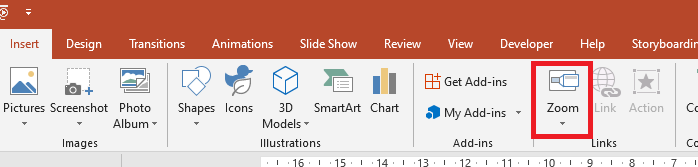

{} 

This page contains release notes for Aspose.Slides for C++ 21.5.

{} 

## **Supported Platforms**
- Aspose.Slides for C++ for Windows x64 (Microsoft Visual C++).
- Aspose.Slides for C++ for Windows x86 (Microsoft Visual C++).
- Aspose.Slides for C++ for Linux (Clang).

## New Features and Enhancements
|**Key**|**Summary**|**Category**|
| :- | :- | :- |
|SLIDESNET-40842|Support for Zoom for PowerPoint|Feature|
|SLIDESNET-42551|Custom PPT root directory entry object class GUID (CLSID)|Enhancement|
|SLIDESNET-40747|Support for reading autofit scale values|Feature|
|SLIDESNET-42479|Running a macro by clicking a button|Feature|

## Other Improvements and Changes
|**Key**|**Summary**|**Category**|
| :- | :- | :- |
|SLIDESCPP-2700|[Use Aspose.Slides for .NET 21.5 features](/slides/net/release-notes/2021/aspose-slides-for-net-21-5-release-notes/)|Enhancement|
|SLIDESCPP-2895|Improve performance of the font caching mechanism|Enhancement|

## Public API Changes ##

### Zoom support has been added ###

The main article on Zoom: [Manage Zoom](https://docs.aspose.com/slides/cpp/manage-zoom/)

When you create a Zoom transition in PowerPoint, you can jump to (and from) specific slides, sections, and portions of your presentation in any order you prefer when presenting:



In Aspose.Slides, to provide the same functionality, we added a new enum [ZoomImageType](https://reference.aspose.com/slides/cpp/namespace/aspose.slides#ac0802a52a7f14a457b62e9761a77e8e2), a new interface [IZoomFrame](https://reference.aspose.com/slides/cpp/class/aspose.slides.i_zoom_frame), and some new additional methods in [IShapeCollection](https://reference.aspose.com/slides/cpp/class/aspose.slides.i_shape_collection).

#### ZoomImageType Enum ####

The [ZoomImageType](https://reference.aspose.com/slides/cpp/namespace/aspose.slides#ac0802a52a7f14a457b62e9761a77e8e2) determines whether the Zoom object uses the slide preview or a cover image.

This is the [ZoomImageType](https://reference.aspose.com/slides/cpp/namespace/aspose.slides#ac0802a52a7f14a457b62e9761a77e8e2) enum definition: 

``` cpp
enum class ZoomImageType
{
    /// <summary>
    /// Use the image of the slide or section.
    /// </summary>
    Preview = 1,
    /// <summary>
    /// Use a custom image.
    /// </summary>
    Cover = 2
};
```

#### IZoomFrame Interface ####

The [IZoomFrame](https://reference.aspose.com/slides/cpp/class/aspose.slides.i_zoom_frame) interface with the [ZoomFrame](https://reference.aspose.com/slides/cpp/class/aspose.slides.zoom_frame) implementation class has been added:

``` cpp
class IZoomFrame : public virtual Aspose::Slides::IGraphicalObject
{
public:
    /// <summary>
    /// Gets the image type of a zoom object.
    /// Read <see cref="ZoomImageType"></see>.
    /// Default value: Preview
    /// </summary>
    
    virtual ZoomImageType get_ImageType() = 0;
    /// <summary>
    /// Sets the image type of a zoom object.
    /// Write <see cref="ZoomImageType"></see>.
    /// Default value: Preview
    /// </summary>
    
    virtual void set_ImageType(ZoomImageType value) = 0;
    /// <summary>
    /// Gets the navigation behavior in slideshow.
    /// Read <see cref="bool"></see>.
    /// Default value: false
    /// </summary>
    
    virtual bool get_ReturnToParent() = 0;
    /// <summary>
    /// Sets the navigation behavior in slideshow.
    /// Write <see cref="bool"></see>.
    /// Default value: false
    /// </summary>
    
    virtual void set_ReturnToParent(bool value) = 0;
    /// <summary>
    /// Gets the slide object that the Slide Zoom object links to.
    /// Read <see cref="Aspose::Slides::ISlide">ISlide</see>.
    /// </summary>
    
    virtual System::SharedPtr<ISlide> get_TargetSlide() = 0;
    /// <summary>
    /// Sets the slide object that the Slide Zoom object links to.
    /// Write <see cref="Aspose::Slides::ISlide">ISlide</see>.
    /// </summary>
    
    virtual void set_TargetSlide(System::SharedPtr<ISlide> value) = 0;
    /// <summary>
    /// Gets value that specifies whether the Zoom will use the background of the destination slide.
    /// Read <see cref="bool"></see>.
    /// Default value: true
    /// </summary>
    
    virtual bool get_ShowBackground() = 0;
    /// <summary>
    /// Sets value that specifies whether the Zoom will use the background of the destination slide.
    /// Write <see cref="bool"></see>.
    /// Default value: true
    /// </summary>
    
    virtual void set_ShowBackground(bool value) = 0;
    /// <summary>
    /// Gets image for zoom object.
    /// Read <see cref="Aspose::Slides::IPPImage">IPPImage</see>.
    /// </summary>
    
    virtual System::SharedPtr<IPPImage> get_Image() = 0;
    /// <summary>
    /// Sets image for zoom object.
    /// Write <see cref="Aspose::Slides::IPPImage">IPPImage</see>.
    /// </summary>
    
    virtual void set_Image(System::SharedPtr<IPPImage> value) = 0;
    /// <summary>
    /// Gets the duration of the transition between Zoom and slide.
    /// Read <see cref="float"></see>.
    /// Default value: 1.0f
    /// </summary>
    
    virtual float get_TransitionDuration() = 0;
    /// <summary>
    /// Sets the duration of the transition between Zoom and slide.
    /// Write <see cref="float"></see>.
    /// Default value: 1.0f
    /// </summary>
    virtual void set_TransitionDuration(float value) = 0;
};
```

#### New methods in IShapeCollection interface have been added ####

These new methods create [ZoomFrame](https://reference.aspose.com/slides/cpp/class/aspose.slides.zoom_frame) objects:

``` cpp
/// <summary>
/// Adds a new Zoom object to the end of a collection.
/// </summary>
virtual System::SharedPtr<IZoomFrame> AddZoomFrame(float x, float y, float width, float height, System::SharedPtr<ISlide> slide) = 0;

/// <summary>
/// Adds a new Zoom object to the end of a collection.
/// </summary>
virtual System::SharedPtr<IZoomFrame> AddZoomFrame(float x, float y, float width, float height, System::SharedPtr<ISlide> slide, System::SharedPtr<IPPImage> image) = 0;

/// <summary>
/// Creates a new Zoom object and inserts it to a collection at the specified index.
/// </summary>
virtual System::SharedPtr<IZoomFrame> InsertZoomFrame(int32_t index, float x, float y, float width, float height, System::SharedPtr<ISlide> slide) = 0;

/// <summary>
/// Creates a new Zoom object and inserts it to a collection at the specified index.
/// </summary>
virtual System::SharedPtr<IZoomFrame> InsertZoomFrame(int32_t index, float x, float y, float width, float height, System::SharedPtr<ISlide> slide, System::SharedPtr<IPPImage> image) = 0;
```

#### Example ####

This example shows you how to create a [ZoomFrame](https://reference.aspose.com/slides/cpp/class/aspose.slides.zoom_frame) object with a custom image and specified image frame:

``` cpp
auto pres = System::MakeObject<Presentation>();
//Add a new slide to the presentation
auto slide = pres->get_Slides()->AddEmptySlide(pres->get_Slides()->idx_get(0)->get_LayoutSlide());
// Create a new image for zoom object
auto image = pres->get_Images()->AddImage(System::Drawing::Image::FromFile(u"image.png"));
// Add ZoomFrame object
auto zoomFrame = pres->get_Slides()->idx_get(0)->get_Shapes()->AddZoomFrame(20.0f, 20.0f, 300.0f, 200.0f, slide, image);
// Set zoom frame format
zoomFrame->get_LineFormat()->set_Width(5);
zoomFrame->get_LineFormat()->get_FillFormat()->set_FillType(Aspose::Slides::FillType::Solid);
zoomFrame->get_LineFormat()->get_FillFormat()->get_SolidFillColor()->set_Color(System::Drawing::Color::get_HotPink());
zoomFrame->get_LineFormat()->set_DashStyle(Aspose::Slides::LineDashStyle::DashDot);
// Save the presentation
pres->Save(u"presentation.pptx", Aspose::Slides::Export::SaveFormat::Pptx);
```

### IHyperlinkManager::SetMacroHyperlinkClick method has been added ###

A new method, [SetMacroHyperlinkClick](https://reference.aspose.com/slides/cpp/class/aspose.slides.i_hyperlink_manager#a7717fd76e815b2a1d222d7be13077b17), has been added to the [IHyperlinkManager](https://reference.aspose.com/slides/net/aspose.slides/ihyperlinkmanager) interface and [HyperlinkManager](https://reference.aspose.com/slides/net/aspose.slides/hyperlinkmanager) class.

The [SetMacroHyperlinkClick](https://reference.aspose.com/slides/cpp/class/aspose.slides.i_hyperlink_manager#a7717fd76e815b2a1d222d7be13077b17) method is used to set a macro hyperlink on a click for a shape.

Method declaration:

``` cpp
/// <summary>
/// Set Macro hyperlink on a click.
/// </summary>
virtual System::SharedPtr<IHyperlink> SetMacroHyperlinkClick(System::String macroName) = 0;
```

This code snippet shows you how the [SetMacroHyperlinkClick](https://reference.aspose.com/slides/cpp/class/aspose.slides.i_hyperlink_manager#a7717fd76e815b2a1d222d7be13077b17) method is used to set a macro hyperlink click on a shape:

``` cpp
auto presentation = System::MakeObject<Presentation>();
auto  shape = presentation->get_Slides()->idx_get(0)->get_Shapes()->AddAutoShape(Aspose::Slides::ShapeType::BlankButton, 20.0f, 20.0f, 80.0f, 30.0f);
shape->get_HyperlinkManager()->SetMacroHyperlinkClick(u"MacroName");
```

### IPptOptions::get_RootDirectoryClsid() and IPptOptions::set_RootDirectoryClsid() methods have been added

New [get_RootDirectoryClsid()](https://reference.aspose.com/slides/cpp/class/aspose.slides.export.i_ppt_options#a11784c14d151573ac9dd6eaa8539866e) and [set_RootDirectoryClsid()](https://reference.aspose.com/slides/cpp/class/aspose.slides.export.i_ppt_options#a959357e06ce79d748c81fb43b08e22a1) methods have been added to [IPptOptions](https://reference.aspose.com/slides/cpp/class/aspose.slides.export.i_ppt_options) interface and [PptOptions](https://reference.aspose.com/slides/cpp/class/aspose.slides.export.i_ppt_options) class.
The RootDirectoryClsid property represents the object class GUID (CLSID) that is stored in the root directory entry. It can be used for COM activation of the document's application.

Methods declaration:
``` cpp
/// <summary>
/// Represents the object class GUID (CLSID) that is stored in the root directory entry. Can be used for COM
/// activation of the document's application.
/// The default value is '64818D11-4F9B-11CF-86EA-00AA00B929E8' that corresponds to 'Microsoft Powerpoint.Slide.8'.
/// </summary>
virtual System::Guid get_RootDirectoryClsid() = 0;

/// <summary>
/// Represents the object class GUID (CLSID) that is stored in the root directory entry. Can be used for COM
/// activation of the document's application.
/// The default value is '64818D11-4F9B-11CF-86EA-00AA00B929E8' that corresponds to 'Microsoft Powerpoint.Slide.8'.
/// </summary>
virtual void set_RootDirectoryClsid(System::Guid value) = 0;
```

This code snippet shows you how the custom RootDirectoryClsid can be set:

``` cpp
auto pres = System::MakeObject<Presentation>();
auto  pptOptions = System::MakeObject<PptOptions>();

// set CLSID to 'Microsoft Powerpoint.Show.8'
pptOptions->set_RootDirectoryClsid(System::Guid(u"64818D10-4F9B-11CF-86EA-00AA00B929E8"));
pres->Save(u"pres.ppt", Aspose::Slides::Export::SaveFormat::Ppt, pptOptions);
```