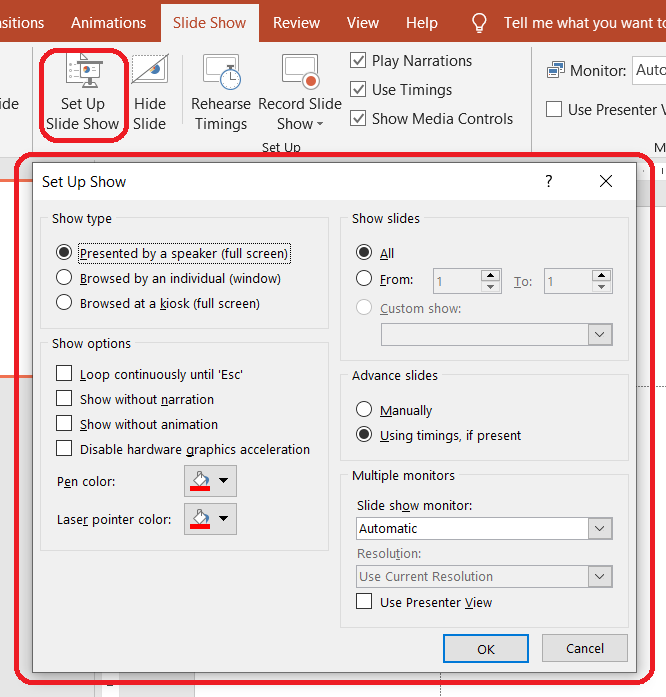

{} 

This page contains release notes for [Aspose.Slides for C++ 22.8](https://www.nuget.org/packages/Aspose.Slides.Cpp/)

{} 

## Supported Platforms
- Aspose.Slides for C++ for Windows x64/x86 (Microsoft Visual Studio 2017 or later).
- Aspose.Slides for C++ for Linux (Clang 3.9 or later, GCC 6.1 or later).
- Aspose.Slides for C++ for macOS (Xcode 13.4 or later).

## New Features and Enhancements
|**Key**|**Summary**|**Category**|**Related Documentation**|
| :- | :- | :- | :- |
|SLIDESNET-40604|Rendering presentation to pure HTML without SVG parent tag|Feature|<https://docs.aspose.com/slides/net/export-to-html5/>|
|SLIDESNET-43244|Failed to check "Transitions / Advance Slide / After" flag|Enhancement|<https://docs.aspose.com/slides/net/slide-transition/>|
|SLIDESNET-42740|Changing slide number does not work|Enhancement|<https://docs.aspose.com/slides/net/presentation-header-and-footer/>|
|SLIDESNET-36907|Support to set slide show settings|Feature||
|SLIDESNET-35994|Add support of 3-D Surface chart type|Feature|<https://docs.aspose.com/slides/net/create-chart/>|
|SLIDESNET-42752|Extracting audio file from slide timeline|Feature|<https://docs.aspose.com/slides/net/shape-animation/>|
|SLIDESNET-43269|Incorrect layouting of text lines when converting PPT slides to JPG/SVG|Enhancement|<https://docs.aspose.com/slides/net/convert-slide/>|
|SLIDESNET-43261|Supporting "Slide Show" / "Set Up Show" settings|Feature||

## Other Improvements and Changes
|**Key**|**Summary**|**Category**|**Related Documentation**|
| :- | :- | :- | :- |
|SLIDESCPP-3315|Use Aspose.Slides for .NET 22.8 features|Enhancement|<https://docs.aspose.com/slides/net/aspose-slides-for-net-22-8-release-notes/>|
|SLIDESCPP-3533|Effective fill type of a text box equals Solid instead of NoFill|Bug|<https://docs.aspose.com/slides/cpp/shape-formatting/>|

## Public API Changes

### Presentation Slide Show Setup Settings support ###

We implemented support for Presentation Slide Show Settings.



These are the relevant classes and methods:

* [Presentation::get_SlideShowSettings()](https://reference.aspose.com/slides/cpp/class/aspose.slides.presentation#a8bf038a4010333d34bb41bd82db77db8) method - allows you to specify the slide show settings for a presentation.
* [SlideShowSettings](https://reference.aspose.com/slides/cpp/class/aspose.slides.slide_show_settings/) class - represents the slide show settings for the presentation. It provides these methods:
  - [get_SlideShowType()](https://reference.aspose.com/slides/cpp/class/aspose.slides.slide_show_settings#a1c6dc3817480b8a6a0152daa749dc097), [set_SlideShowType()](https://reference.aspose.com/slides/cpp/class/aspose.slides.slide_show_settings#ab42602fb4d746fb82235bd195a5b1611)
  - [get_Loop()](https://reference.aspose.com/slides/cpp/class/aspose.slides.slide_show_settings#a70b26b17cd5282c4063fbbcdc9fd5059), [set_Loop()](https://reference.aspose.com/slides/cpp/class/aspose.slides.slide_show_settings#af75aa11230560797d376c4c9962c80dc)
  - [get_ShowNarration()](https://reference.aspose.com/slides/cpp/class/aspose.slides.slide_show_settings#a6810668b15792cbe1e31db94d8dfe8a9), [set_ShowNarration()](https://reference.aspose.com/slides/cpp/class/aspose.slides.slide_show_settings#a1f2597208246a2fc1e0f5918f8edd791)
  - [get_ShowAnimation()](https://reference.aspose.com/slides/cpp/class/aspose.slides.slide_show_settings#a9a788d741b885ca40d0b290c79e8d8c3), [set_ShowAnimation()](https://reference.aspose.com/slides/cpp/class/aspose.slides.slide_show_settings#a09c1a471b322ff27ec0f07614729a362)
  - [get_PenColor()](https://reference.aspose.com/slides/cpp/class/aspose.slides.slide_show_settings#a32e6c956e401ffc3498f85623a3f4f86)
  - [get_Slides()](https://reference.aspose.com/slides/cpp/class/aspose.slides.slide_show_settings#a5c1611f1a4e68e2b5edc9b95510a7023), [set_Slides()](https://reference.aspose.com/slides/cpp/class/aspose.slides.slide_show_settings#a6be954f5684e538dfc4f500a03a4a364)
  - [get_UseTimings()](https://reference.aspose.com/slides/cpp/class/aspose.slides.slide_show_settings#abc0f42c80fc2863ab2c49f0ae3129246), [set_UseTimings()](https://reference.aspose.com/slides/cpp/class/aspose.slides.slide_show_settings#ac7c28ef9607dea70db68d4770fea3dcf)
* [BrowsedAtKiosk](https://reference.aspose.com/slides/cpp/class/aspose.slides.browsed_at_kiosk/) class - represents the **Browsed at a kiosk (full screen)** parameter.
* [BrowsedByIndividual](https://reference.aspose.com/slides/cpp/class/aspose.slides.browsed_by_individual/) class - represents the **Browsed by individual (window)** parameter.
* [PresentedBySpeaker](https://reference.aspose.com/slides/cpp/class/aspose.slides.presented_by_speaker/) class - represents the **Presented by a speaker (full screen)** parameter.
* [SlidesRange](https://reference.aspose.com/slides/cpp/class/aspose.slides.slides_range/) class - represents the slides range.

This C++ code shows you how to set the **Presented by a speaker** parameter for a slide show:

``` cpp
auto pres = System::MakeObject<Presentation>();
    
pres->get_SlideShowSettings()->set_SlideShowType(System::MakeObject<PresentedBySpeaker>());
pres->Save(u"pres.pptx", Aspose::Slides::Export::SaveFormat::Pptx);
```

**Browsed by individual** parameter: 

``` cpp
auto pres = System::MakeObject<Presentation>();
    
auto browsedByIndividual = System::MakeObject<BrowsedByIndividual>();
browsedByIndividual->set_ShowScrollbar(true);
pres->get_SlideShowSettings()->set_SlideShowType(browsedByIndividual);
pres->Save(u"pres.pptx", Aspose::Slides::Export::SaveFormat::Pptx);
```

### Effect::get_Sound() and Effect::set_Sound() methods have been added ###

Support for Embedded sound effect has been implemented through the [Effect::get_Sound()](https://reference.aspose.com/slides/cpp/class/aspose.slides.animation.effect#a1b18b7be1e4c9766a09933ac8abcd7fa) and [Effect::set_Sound()](https://reference.aspose.com/slides/cpp/class/aspose.slides.animation.effect#ac1d1269d838db1c7e9ffeb6380e68720) methods.
 

``` cpp
auto presentation = System::MakeObject<Presentation>(u"demo.pptx");
    
auto slide = presentation->get_Slides()->idx_get(0);
    
// Gets the effects sequence for the slide
auto effectsSequence = slide->get_Timeline()->get_MainSequence();
    
for (auto& effect : effectsSequence)
{
    if (effect->get_Sound() == nullptr)
    {
        continue;
    }
    // Extracts the effect sound in byte array
    auto audio = effect->get_Sound()->get_BinaryData();
}
```
