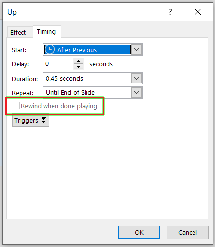

{} 

This page contains release notes for [Aspose.Slides for C++ 23.3](https://www.nuget.org/packages/Aspose.Slides.Cpp/)

{} 

## Supported Platforms
- Aspose.Slides for C++ for Windows x64/x86 (Microsoft Visual Studio 2017 or later).
- Aspose.Slides for C++ for Linux (Clang 3.9 or later, GCC 6.1 or later).
- Aspose.Slides for C++ for macOS (Xcode 13.4 or later).

## New Features and Enhancements
|**Key**|**Summary**|**Category**|**Related Documentation**|
| :- | :- | :- | :- |
|SLIDESNET-43760|Managing Trim Video settings|Feature|<https://docs.aspose.com/slides/net/convert-powerpoint-to-video/>|
|SLIDESNET-43659|Animation timing settings: Rewind when done playing|Feature|<https://docs.aspose.com/slides/net/shape-animation/#change-animation-effect-timing-properties>|
|SLIDESNET-43672|EMF images are blurred when converting PPTX to PDF|Enhancement|<https://docs.aspose.com/slides/net/convert-powerpoint-to-pdf/>|
|SLIDESNET-43634|Add support for Audio/Video plugin in ODP format|Feature|<https://docs.aspose.com/slides/net/convert-openoffice-odp/>|

## Other Improvements and Changes
|**Key**|**Summary**|**Category**|**Related Documentation**|
| :- | :- | :- | :- |
|SLIDESCPP-3611|Use Aspose.Slides for .NET 23.3 features|Enhancement|<https://docs.aspose.com/slides/net/aspose-slides-for-net-23-3-release-notes/>|
|SLIDESCPP-3578|Improve usability of Aspose.Slides for C++ API for setter expressions|Enhancement||

## Public API Changes

### New methods have been added to various interfaces and classes to improve API usability.

These methods have been added to reduce the complexity of invocation chains.

> It should be noted that the old way can still be used and is fully equivalent to the new way.

**List of methods:**

|**Class name**|**Ordinary syntax**|**New improved syntax**|
| :- | :- | :- |
|Aspose&colon;&colon;Slides&colon;&colon;Animation&colon;&colon;IEffect|get_Behaviors()->idx_set(index, value)|set_Behavior(index, value)|
|Aspose&colon;&colon;Slides&colon;&colon;Animation&colon;&colon;Effect|get_Behaviors()->idx_set(index, value)|set_Behavior(index, value)|
|Aspose&colon;&colon;Slides&colon;&colon;ICustomData|get_Tags()->idx_set(name, value)|set_Tag(name, value)|
|Aspose&colon;&colon;Slides&colon;&colon;CustomData|get_Tags()->idx_set(name, value)|set_Tag(name, value)|
|Aspose&colon;&colon;Slides&colon;&colon;IControl|get_Properties()->idx_set(name, value)|set_Property(name, value)|
|Aspose&colon;&colon;Slides&colon;&colon;Control|get_Properties()->idx_set(name, value)|set_Property(name, value)|
|Aspose&colon;&colon;Slides&colon;&colon;IColorFormat|get_ColorTransform()->idx_set(index, value)|set_ColorOperation(index, value)|
|Aspose&colon;&colon;Slides&colon;&colon;ColorFormat|get_ColorTransform()->idx_set(index, value)|set_ColorOperation(index, value)|
|Aspose&colon;&colon;Slides&colon;&colon;IPresentation| get_DocumentProperties()->idx_set(name, value)|set_DocumentProperty(name, value)|
|Aspose&colon;&colon;Slides&colon;&colon;Presentation| get_DocumentProperties()->idx_set(name, value)|set_DocumentProperty(name, value)|

**Example:**

This code snippet:
``` cpp
presentation->get_Tags()->idx_set(u"Content Creator", u"My Name");
```

Can be rewritten as follows:
```cpp
presentation->set_Tag(u"Content Creator", u"My Name");
```

### Animation timing settings

The [ITiming::get_Rewind()](https://reference.aspose.com/slides/cpp/class/aspose.slides.animation.i_timing#a29eb6f5833df5a3e434f849812bb35ea) and [ITiming::set_Rewind()](https://reference.aspose.com/slides/cpp/class/aspose.slides.animation.i_timing#ad983148f52733f50d5a02cddfaeeeb77) methods have been added to specify whether an effect will rewind after playing.



Example:

``` cpp
 System::SharedPtr<Presentation> presentation = System::MakeObject<Presentation>(u"demo.pptx");
        
// Gets the effects sequence for the first slide
System::SharedPtr<ISequence> effectsSequence = presentation->get_Slide(0)->get_Timeline()->get_MainSequence();
        
// Gets the first effect of the main sequence.
System::SharedPtr<IEffect> effect = effectsSequence->idx_get(0);
        
// Turns the effect Timing/Rewind on.
effect->get_Timing()->set_Rewind(true);}
```

### Trim Video Settings

The [IVideoFrame::get_TrimFromStart()](https://reference.aspose.com/slides/cpp/class/aspose.slides.i_video_frame#a72cf4a6b612b628c0a5fd0b4e42e9606), [IVideoFrame::set_TrimFromStart()](https://reference.aspose.com/slides/cpp/class/aspose.slides.i_video_frame#adbc18089bc70f22d1137dc1154cace33), [IVideoFrame::get_TrimFromEnd()](https://reference.aspose.com/slides/cpp/class/aspose.slides.i_video_frame#a9b9e961053ce428c662ec588a0436ba3), and [IVideoFrame::set_TrimFromEnd()](https://reference.aspose.com/slides/cpp/class/aspose.slides.i_video_frame#acaa24971be75df0d851e74bf96413e01) methods have been added to manage Trim Video settings.


Example:

``` cpp
System::SharedPtr<Presentation> pres = System::MakeObject<Presentation>();
        
System::SharedPtr<ISlide> slide = pres->get_Slide(0);
System::SharedPtr<IVideo> video = pres->get_Videos()->AddVideo(System::IO::File::ReadAllBytes(u"video.mp4"));
System::SharedPtr<IVideoFrame> videoFrame = slide->get_Shapes()->AddVideoFrame(0.0f, 0.0f, 100.0f, 100.0f, video);

// sets the trimming start time to 1sec
videoFrame->set_TrimFromStart(1000.f);

// sets the triming end time to 2sec
videoFrame->set_TrimFromEnd(2000.f);
```

### IChartDataPoint::get_Index() method has been added

To allow you determine what parent's children collection this data point applies to, the [IChartDataPoint::get_Index()](https://reference.aspose.com/slides/cpp/class/aspose.slides.charts.i_chart_data_point#a8ef46e994db5b533e86b0628cf058de4) property has been added.

Example:

``` cpp
System::SharedPtr<Presentation> presentation = System::MakeObject<Presentation>(u"pres.pptx");
System::SharedPtr<Chart> chart = System::ExplicitCast<Aspose::Slides::Charts::Chart>(presentation->get_Slide(0)->get_Shape(0));
System::SharedPtr<IChartDataPointCollection> dataPoints = chart->get_ChartData()->get_ChartSeries(0)->get_DataPoints();

for (auto&& dataPoint : dataPoints)
{
    System::Console::WriteLine(u"Point with index {0} is applied to {1}", dataPoint->get_Index(), dataPoint->get_Value());
}
```