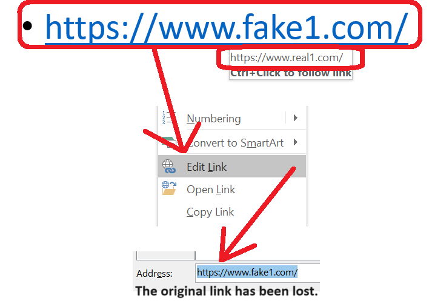

{} 

This page contains release notes for [Aspose.Slides for C++ 24.3](https://www.nuget.org/packages/Aspose.Slides.Cpp/)

{} 

## Supported Platforms
- Aspose.Slides for C++ for Windows x64/x86 (Microsoft Visual Studio 2017 or later).
- Aspose.Slides for C++ for Linux (Clang 3.9 or later, GCC 6.1 or later, glibc 2.23 or later).
- Aspose.Slides for C++ for macOS x86_64/ARM64 (Xcode 13.4 or later).

## New Features and Enhancements
|**Key**|**Summary**|**Category**|**Related Documentation**|
| :- | :- | :- | :- |
|SLIDESNET-44447|Hyperlinks in the exported PDF are shifted to the right|Enhancement|<https://docs.aspose.com/slides/net/convert-powerpoint-to-pdf/>|
|SLIDESCPP-3881|Use Aspose.Slides for .NET 24.3 features|Enhancement|<https://releases.aspose.com/slides/net/release-notes/2024/aspose-slides-for-net-24-3-release-notes/>|


## Public API Changes

### The new method IHyperlink::get_ExternalUrlOriginal() has been added

The get_ExternalUrlOriginal() method returns the hyperlink set for this portion without regard to the actual content of the portion.

PowerPoint behaves specifically for links and their corresponding text in a portion. It allows to create text for the hyperlink in the form of a valid URL, different from the real address of the link. In this case, when you view the link in the edit window, it will be changed to match the text portion. This property represents the original value of the hyperlink.

How the original link is lost:



Example:

``` cpp
auto presentation = System::MakeObject<Presentation>(u"pres.pptx");

auto portion = (System::ExplicitCast<Aspose::Slides::AutoShape>(presentation->get_Slide(0)->get_Shape(1)))->get_TextFrame()->get_Paragraph(0)->get_Portion(0);

auto externalUrl = portion->get_PortionFormat()->get_HyperlinkClick()->get_ExternalUrl(); // fake URL

auto externalUrlOriginal = portion->get_PortionFormat()->get_HyperlinkClick()->get_ExternalUrlOriginal(); // real URL
```

