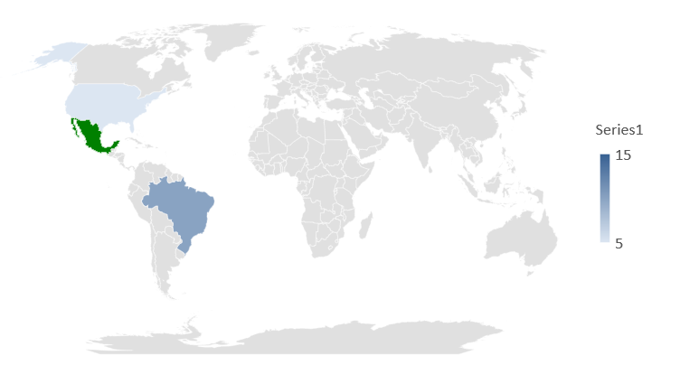

{} 

This page contains release notes for [Aspose.Slides for Java 20.11](https://releases.aspose.com/java/repo/com/aspose/aspose-slides/20.11/)

{} 

## **New Features and Enhancements**
|**Key**|**Summary**|**Category**|
| :- | :- | :- |
|SLIDESNET-36008|Support to verify the presentation password|Feature|
|SLIDESNET-42201|Ability to test presentation password to open|Feature|
|SLIDESNET-38917|Ability to test presentation password to modify|Feature|
|SLIDESNET-42020|Support for Map type chart in Aspose.Slides|Feature|

## **Other Improvements and Changes**
|**Key**|**Summary**|**Category**|
| :- | :- | :- |
|SLIDESJAVA-37956|Use Aspose.Slides for Net 20.11 features|Enhancement|
|SLIDESJAVA-38172|Can't convert pptx file. Class com.aspose.slides.PptxReadException: Unknown series type|Bug|
|SLIDESJAVA-36406|Ability to test presentation password to modify|Feature|
|SLIDESJAVA-38313|Bullet indentation is disturbed on importing HTML|Bug|
|SLIDESJAVA-37562|Exception when doing renderToGraphics|Bug|
|SLIDESJAVA-36885|Exception on loading presentation|Bug|
|SLIDESJAVA-36901|Embedded Font Issue when opening PowerPoint in MAC|Enhancement|
|SLIDESJAVA-38149|Exception on exporting to PDF|Bug|
|SLIDESJAVA-38339|Illegal operation occurred|Investigation|

## **Public API Changes**
### 3D Support Added
A new own cross-platform 3D engine was implemented in Slides 20.11. This new engine will now enable functionality to export and rasterize shapes and text with 3D effects. If in the previous versions of Slides shapes that have the 3D effect applied on them were rendered flat, now it is possible to render shapes with a full-fledged 3D.

In addition to that now it is possible to create shapes with 3D effects via Slides public API:
```java
Presentation pres = new Presentation();
try {
    IAutoShape shape = pres.getSlides().get_Item(0).getShapes().addAutoShape(ShapeType.Rectangle, 200, 150, 200, 200);
    shape.getTextFrame().setText("3D");
    shape.getTextFrame().getParagraphs().get_Item(0).getParagraphFormat().getDefaultPortionFormat().setFontHeight(64);

    shape.getThreeDFormat().getCamera().setCameraType(CameraPresetType.OrthographicFront);
    shape.getThreeDFormat().getCamera().setRotation(20, 30, 40);
    shape.getThreeDFormat().getLightRig().setLightType(LightRigPresetType.Flat);
    shape.getThreeDFormat().getLightRig().setDirection(LightingDirection.Top);
    shape.getThreeDFormat().setMaterial(MaterialPresetType.Flat);
    shape.getThreeDFormat().setExtrusionHeight(100);
    shape.getThreeDFormat().getExtrusionColor().setColor(Color.BLUE);

    try {
        ImageIO.write(pres.getSlides().get_Item(0).getThumbnail(2, 2), "PNG", new File("sample_3d.png"));
    } catch (IOException e) { }
    pres.save("sandbox_3d.pptx", SaveFormat.Pptx);
} finally {
    if (pres != null) pres.dispose();
}
```

The rendered thumbnail will look like that:


### Checking password to open via IPresentationInfo interface
**[checkPassword()](https://reference.aspose.com/slides/java/com.aspose.slides/IPresentationInfo#checkPassword-java.lang.String-)** 
method has been added to **[IPresentationInfo](https://reference.aspose.com/slides/java/com.aspose.slides/IPresentationInfo)** 
interface and **[PresentationInfo](https://reference.aspose.com/slides/java/com.aspose.slides/PresentationInfo)** class. 
This method allows checking whether a presentation is protected by a password to open.

Method declaration:
```java
/**
 * Checks whether a password is correct for a presentation protected with open password.
 *
 * IPresentationInfo info = PresentationFactory.getInstance().getPresentationInfo("pres.pptx");
 * boolean isPasswordCorrect = info.checkPassword("my_password");
 * 
 * @return True if the presentation is protected with open password and the password is correct and false otherwise.
 * @param password The password to check.
 * 
 * When the password is null or empty, this method returns false.
 */
public boolean checkPassword(String password);
```

The example below demonstrates how to check a password to open a presentation:
```java
IPresentationInfo info = PresentationFactory.getInstance().getPresentationInfo("pres.pptx");
boolean isPasswordCorrect = info.checkPassword("my_password");
```

### getKeepTextFlat() and setKeepTextFlat() methods have been added to ITextFrameFormat
New methods **[getKeepTextFlat()](https://reference.aspose.com/slides/java/com.aspose.slides/ITextFrameFormat#getKeepTextFlat--)** 
and **[setKeepTextFlat()](https://reference.aspose.com/slides/java/com.aspose.slides/ITextFrameFormat#setKeepTextFlat-boolean-)** 
have been added to **[ITextFrameFormat](https://reference.aspose.com/slides/java/com.aspose.slides/ITextFrameFormat)** interface.

Using these methods allows to keep text out of 3D scene entirely.

Properties declaration:

```java
/**
 * <p>
 * Returns or set keeping text out of 3D scene entirely.
 * Read/write {@code boolean}.
 * </p>
 */
public boolean getKeepTextFlat();
/**
 * <p>
 * Returns or set keeping text out of 3D scene entirely.
 * Read/write {@code boolean}.
 * </p>
 */
public void setKeepTextFlat(boolean value);
```

The code snippet below demonstrates setting keep text out of 3D scene:

```java
Presentation pres = new Presentation("Presentation.pptx");
try {
    IAutoShape shape = (AutoShape)pres.getSlides().get_Item(0).getShapes().get_Item(0);
    shape.getTextFrame().getTextFrameFormat().setKeepTextFlat(true);
} finally {
    if (pres != null) pres.dispose();
}
```

### Partial support of Map charts has been added
Partial support of Map charts has been added. It means that you can create, edit, and save charts. Rendering options are limited since Microsoft Office uses Bing data provider for generating chart image. 
So any changes related to the Map charts made within Aspose.Slides won't affect the rendering results. 
If the chart was loaded from an input file, the cached image from the PPTX package will be used for rendering purposes. 

Following enum values have been added:

- **[CombinableSeriesTypesGroup.MapChart](https://reference.aspose.com/slides/java/com.aspose.slides/CombinableSeriesTypesGroup#MapChart)**

- **[ChartType.Map](https://reference.aspose.com/slides/java/com.aspose.slides/ChartType#Map)**

Methods:

- **[IChartDataPointCollection.addDataPointForMapSeries(IChartDataCell)](https://reference.aspose.com/slides/java/com.aspose.slides/IChartDataPointCollection#addDataPointForMapSeries-com.aspose.slides.IChartDataCell-)**

- **[IChartDataPoint.getColorValue()](https://reference.aspose.com/slides/java/com.aspose.slides/IChartDataPoint#getColorValue--)**

Following **example** shows how to create a map chart from scratch:
```java
Presentation presentation = new Presentation();
try {
    //create empty chart
    IChart chart = presentation.getSlides().get_Item(0).getShapes().addChart(ChartType.Map, 50, 50, 500, 400, false);

    IChartDataWorkbook wb = chart.getChartData().getChartDataWorkbook();

    //Add series and few data points
    IChartSeries series = chart.getChartData().getSeries().add(ChartType.Map);
    series.getDataPoints().addDataPointForMapSeries(wb.getCell(0, "B2", 5));
    series.getDataPoints().addDataPointForMapSeries(wb.getCell(0, "B3", 1));
    series.getDataPoints().addDataPointForMapSeries(wb.getCell(0, "B4", 10));

    //add categories
    chart.getChartData().getCategories().add(wb.getCell(0, "A2", "United States"));
    chart.getChartData().getCategories().add(wb.getCell(0, "A3", "Mexico"));
    chart.getChartData().getCategories().add(wb.getCell(0, "A4", "Brazil"));

    //change data point value    
    IChartDataPoint dataPoint = series.getDataPoints().get_Item(1);
    dataPoint.getColorValue().getAsCell().setValue("15");

    //set data point appearance    
    dataPoint.getFormat().getFill().setFillType(FillType.Solid);
    dataPoint.getFormat().getFill().getSolidFillColor().setColor(Color.GREEN);

    presentation.save("output.pptx", SaveFormat.Pptx);
} finally {
    if (presentation != null) presentation.dispose();
}
```


* *When you first open a presentation in PP it may take a few seconds to upload an image of the chart from the Bing service since we don't provide the cached image.*


