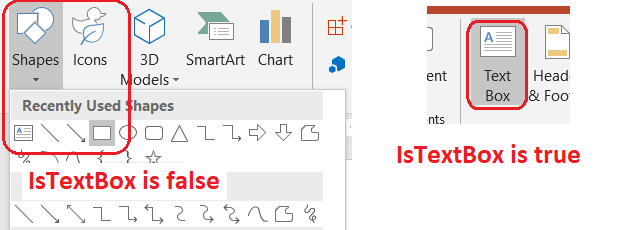

{} 

This page contains release notes for [Aspose.Slides for Java 22.3](https://releases.aspose.com/java/repo/com/aspose/aspose-slides/22.3/)

{} 

|**Key**|**Summary**|**Category**|**Related Documentation**|
| :- | :- | :- | :- |
|SLIDESNET-42621|Add support Bevel for charts|Feature|https://docs.aspose.com/slides/net/create-chart/|
|SLIDESNET-42959|Introduce a flag to indicate if shape was created as text box or not|Enhancement||
|SLIDESNET-43061|Throw a meaningful exception when saving an already Disposed Presentation|Feature|https://docs.aspose.com/slides/net/save-presentation/|
|SLIDESJAVA-38268|[Use Aspose.Slides for Net 22.3 features](/slides/net/release-notes/2022/aspose-slides-for-net-22-3-release-notes/)|Enhancement||
|SLIDESJAVA-38155|Fails to round values of data labels for Pie and Pyramid charts|Bug|https://docs.aspose.com/slides/java/convert-powerpoint-to-png/|
|SLIDESJAVA-34568|3D Chart Content is not showing properly in generated PDF file|Bug|https://docs.aspose.com/slides/java/convert-powerpoint-to-pdf/|
|SLIDESJAVA-38682|PPTX to PDF table issue|Bug|https://docs.aspose.com/slides/java/convert-powerpoint-to-pdf/|
|SLIDESJAVA-33562|3D Cone Chart value axis format changed in generated PDF|Bug|https://docs.aspose.com/slides/java/convert-powerpoint-to-pdf/|
|SLIDESJAVA-38635|Shapes with 3D styles improperly rendered in generated PDF|Bug|https://docs.aspose.com/slides/java/convert-powerpoint-to-pdf/|
|SLIDESJAVA-38695|Exception when converting PPTX to PDF with comments and notes|Bug|https://docs.aspose.com/slides/java/convert-powerpoint-to-pdf/|
|SLIDESJAVA-38714|3D effects on charts are lost in generated PDF|Bug|https://docs.aspose.com/slides/java/convert-powerpoint-to-pdf/|
|SLIDESJAVA-38722|Loading PPTX file throws PptxReadException: Invalid SvgMsStyle|Bug|https://docs.aspose.com/slides/java/open-presentation/|
|SLIDESJAVA-38737|High CPU usage and very long PPTX to PDF conversion time|Investigation|https://docs.aspose.com/slides/java/convert-powerpoint-to-pdf/|
|SLIDESJAVA-37758|White background appearing behind image in generated thumbnail|Bug|https://docs.aspose.com/slides/java/convert-powerpoint-to-png/|


## **Public API Changes**

### AutoShape.isTextBox method was added

[AutoShape.isTextBox](https://reference.aspose.com/slides/java/com.aspose.slides/AutoShape#isTextBox--) method was added to indicate if the shape was created as a text box or not. The screenshot below demonstrates two scenarios when a shape will be created as a text box and a regular shape:



This code snippet demonstrates iteration over all [Presentation](https://reference.aspose.com/slides/java/com.aspose.slides/Presentation) shapes and out to console if the shape is a text box or not (if the shape is [AutoShape](https://reference.aspose.com/slides/java/com.aspose.slides/AutoShape)).

``` java
Presentation pres = new Presentation("pres.pptx");
try {
    ForEach.shape(pres, (shape, slide, index) ->
    {
        if (shape instanceof AutoShape)
        {
            AutoShape autoShape = (AutoShape)shape;
            System.out.println(autoShape.isTextBox() ? "shape is text box" : "shape is text not box");
        }
    });
} finally {
    if (pres != null) pres.dispose();
}
```

### Classes inherited from EffectEffectiveData removed from public API

The follwoing classes that inherited from EffectEffectiveData were removed from the public API:

* AlphaBiLevelEffectiveData
* AlphaModulateFixedEffectiveData
* AlphaReplaceEffectiveData
* BiLevelEffectiveData
* BlurEffectiveData
* ColorChangeEffectiveData
* ColorReplaceEffectiveData
* DuotoneEffectiveData
* FillOverlayEffectiveData
* GlowEffectiveData
* HSLEffectiveData
* InnerShadowEffectiveData
* LuminanceEffectiveData
* OuterShadowEffectiveData
* PresetShadowEffectiveData
* ReflectionEffectiveData
* SoftEdgeEffectiveData
* TintEffectiveData

All effective values are still available via corresponding public interfaces, e.g.:

``` java
Presentation pres = new Presentation("pres.pptx");
try {
    ForEach.portion(pres, (portion, para, slide, index) ->
    {
        IPortionFormatEffectiveData effective = portion.getPortionFormat().getEffective();
    });
} finally {
    if (pres != null) pres.dispose();
}
```