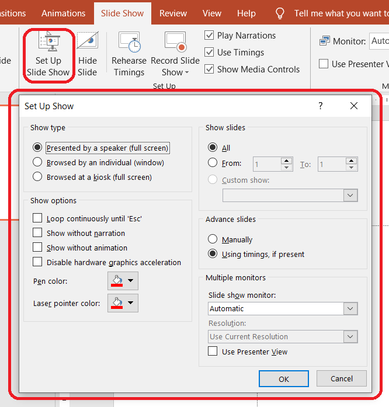

{} 

This page contains release notes for [Aspose.Slides for Java 22.8](https://releases.aspose.com/java/repo/com/aspose/aspose-slides/22.8/)

{} 

|**Key**|**Summary**|**Category**|**Related Documentation**|
| :- | :- | :- | :- |
|SLIDESNET-40604|Rendering presentation to pure HTML without SVG parent tag|Feature|https://docs.aspose.com/slides/net/export-to-html5/|
|SLIDESNET-43244|Failed to check "Transitions / Advance Slide / After" flag|Enhancement|https://docs.aspose.com/slides/net/slide-transition/|
|SLIDESNET-42740|Changing slide number does not work|Enhancement|https://docs.aspose.com/slides/net/presentation-header-and-footer/|
|SLIDESNET-36907|Support to set slide show settings|Feature||
|SLIDESNET-35994|Add support of 3-D Surface chart type|Feature|https://docs.aspose.com/slides/net/create-chart/|
|SLIDESNET-42752|Extracting audio file from slide timeline|Feature|https://docs.aspose.com/slides/net/shape-animation/|
|SLIDESNET-43269|Incorrect layouting of text lines when converting PPT slides to JPG/SVG|Enhancement|https://docs.aspose.com/slides/net/convert-slide/|
|SLIDESNET-43261|Supporting "Slide Show" / "Set Up Show" settings|Feature||
|SLIDESJAVA-38288|[Use Aspose.Slides for Net 22.8 features](/slides/net/release-notes/2022/aspose-slides-for-net-22-8-release-notes/)|Enhancement||
|SLIDESJAVA-38698|Chart.validateChartLayout method throws exceptions depending on data cell value|Bug|https://docs.aspose.com/slides/java/powerpoint-charts/|
|SLIDESJAVA-38854|Fill color of shapes is changed when loading and saving PPT file|Bug|https://docs.aspose.com/slides/java/shape-formatting/|
|SLIDESJAVA-35060|Support to set slide show settings|Feature||
|SLIDESJAVA-38828|Part of HTML content is ignored when added into presentation|Bug|https://docs.aspose.com/slides/java/manage-paragraph/#import-html-text-in-paragraphs|
|SLIDESJAVA-38835|SlideShowSettings class is missing in new versions of Aspose.Slides|Feature||
|SLIDESJAVA-38590|Extracting audio file from slide timeline|Feature|https://docs.aspose.com/slides/java/shape-animation/|
|SLIDESJAVA-38805|Failed to check "Transitions / Advance Slide / After" flag|Enhancement|https://docs.aspose.com/slides/java/slide-transition/|
|SLIDESJAVA-38811|Image is upside down when converting PPTX to PDF|Bug|https://docs.aspose.com/slides/java/convert-powerpoint-to-pdf/|
|SLIDESJAVA-38716|3D chart is not displayed when converting a slide to image|Bug|https://docs.aspose.com/slides/java/convert-powerpoint-to-png/|
|SLIDESJAVA-34566|Missing chart contents in generated PDF file|Bug|https://docs.aspose.com/slides/java/convert-powerpoint-to-pdf/|
|SLIDESJAVA-38852|Loading a presentation throws PptxReadException: LoadAnnotationElementData|Bug|https://docs.aspose.com/slides/java/open-presentation/|
|SLIDESJAVA-38856|Shape background colors are not consistent but values are equal|Bug|https://docs.aspose.com/slides/java/shape-formatting/|
|SLIDESJAVA-34423|Support for exporting animations and slide transitions in generated HTML|Feature|https://docs.aspose.com/slides/java/export-to-html5/|
|SLIDESJAVA-35704|Converting presentation to Html5|Feature|https://docs.aspose.com/slides/java/export-to-html5/|
|SLIDESJAVA-38878|Using effect classes without AutoShape object|Investigation|https://docs.aspose.com/slides/java/shape-effect/|
|SLIDESJAVA-34567|Chart axis are not showing properly in generated PDF file|Bug|https://docs.aspose.com/slides/java/convert-powerpoint-to-pdf/|


## Public API Changes ##

### Presentation Slide Show Setup Settings support ###

We implemented support for Presentation Slide Show Settings.



These are the relevant classes and properties:

* [Presentation.SlideShowSettings](https://reference.aspose.com/slides/java/com.aspose.slides/Presentation#getSlideShowSettings--) property - allows you to specify the slide show settings for a presentation.
* [SlideShowSettings](https://reference.aspose.com/slides/java/com.aspose.slides/SlideShowSettings) class - represents the slide show settings for the presentation. It provides these properties:
  - [SlideShowType](https://reference.aspose.com/slides/java/com.aspose.slides/SlideShowType)
  - [Loop](https://reference.aspose.com/slides/java/com.aspose.slides/SlideShowSettings#getLoop--)
  - [ShowNarration](https://reference.aspose.com/slides/java/com.aspose.slides/SlideShowSettings#getShowNarration--)
  - [ShowAnimation](https://reference.aspose.com/slides/java/com.aspose.slides/SlideShowSettings#getShowAnimation--)
  - [PenColor](https://reference.aspose.com/slides/java/com.aspose.slides/SlideShowSettings#getPenColor--)
  - [Slides](https://reference.aspose.com/slides/java/com.aspose.slides/SlideShowSettings#getSlides--)
  - [UseTimings](https://reference.aspose.com/slides/java/com.aspose.slides/SlideShowSettings#getUseTimings--)
* [BrowsedAtKiosk](https://reference.aspose.com/slides/java/com.aspose.slides/BrowsedAtKiosk) class - represents the **Browsed at a kiosk (full screen)** parameter.
* [BrowsedByIndividual](https://reference.aspose.com/slides/java/com.aspose.slides/BrowsedByIndividual) class - represents the **Browsed by individual (window)** parameter.
* [PresentedBySpeaker](https://reference.aspose.com/slides/java/com.aspose.slides/PresentedBySpeaker) class - represents the **Presented by a speaker (full screen)** parameter.
* [SlidesRange](https://reference.aspose.com/slides/java/com.aspose.slides/SlidesRange) class - represents the slides range.

This Java code shows you how to set the **Presented by a speaker** parameter for a slide show:

``` java
Presentation pres = new Presentation();
try {
    pres.getSlideShowSettings().setSlideShowType(new PresentedBySpeaker());
    pres.save("pres.pptx", SaveFormat.Pptx);
} finally {
    if (pres != null) pres.dispose();
}
```

**Browsed by individual** parameter: 

``` java
Presentation pres = new Presentation();
try {
    BrowsedByIndividual browsedByIndividual = new BrowsedByIndividual();
    browsedByIndividual.setShowScrollbar(true);
    pres.getSlideShowSettings().setSlideShowType(browsedByIndividual);
    pres.save("pres.pptx", SaveFormat.Pptx);
} finally {
    if (pres != null) pres.dispose();
}
```

### Animation Effect.Sound property added ###

Support for Embedded sound effect has been implemented through [Effect.getSound()](https://reference.aspose.com/slides/java/com.aspose.slides/Effect#getSound--) and [Effect.setSound()](https://reference.aspose.com/slides/java/com.aspose.slides/Effect#setSound-com.aspose.slides.IAudio-) methods. 

``` java
Presentation presentation = new Presentation("demo.pptx");
try {
    ISlide slide = presentation.getSlides().get_Item(0);

    // Gets the effects sequence for the slide
    ISequence effectsSequence = slide.getTimeline().getMainSequence();

    for (IEffect effect : effectsSequence)
    {
        if (effect.getSound() == null)
            continue;

        // Extracts the effect sound in byte array
        byte[] audio = effect.getSound().getBinaryData();
    }
} finally {
    if (presentation != null) presentation.dispose();
}
```