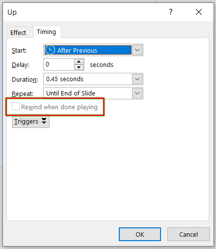

{} 

This page contains release notes for [Aspose.Slides for Java 23.3](https://releases.aspose.com/java/repo/com/aspose/aspose-slides/23.3/)

{} 

|**Key**|**Summary**|**Category**|**Related Documentation**|
| :- | :- | :- | :- |
|SLIDESNET-43760|Managing Trim Video settings|Feature|https://docs.aspose.com/slides/net/convert-powerpoint-to-video/|
|SLIDESNET-43659|Animation timing settings: Rewind when done playing|Feature|https://docs.aspose.com/slides/net/shape-animation/#change-animation-effect-timing-properties|
|SLIDESNET-43672|EMF images are blurred when converting PPTX to PDF|Enhancement|https://docs.aspose.com/slides/net/convert-powerpoint-to-pdf/|
|SLIDESNET-43634|Add support for Audio/Video plugin in ODP format|Feature|https://docs.aspose.com/slides/net/convert-openoffice-odp/|
|SLIDESJAVA-39008|[Use Aspose.Slides for Net 23.3 features](/slides/net/release-notes/2023/aspose-slides-for-net-23-3-release-notes/)|Enhancement||
|SLIDESJAVA-39128|Getting PptxReadException while loading a PPTX file|Bug|https://docs.aspose.com/slides/java/open-presentation/|
|SLIDESJAVA-39053|NotSupportedException is thrown when reading PPT file|Bug|https://docs.aspose.com/slides/java/open-presentation/|
|SLIDESJAVA-39077|Reading PPT file throws KeyNotFoundException|Bug|https://docs.aspose.com/slides/java/open-presentation/|
|SLIDESJAVA-39065|Out of memory exception when loading PPTX file|Bug|https://docs.aspose.com/slides/java/open-presentation/|
|SLIDESJAVA-39061|Animation timing settings: Rewind when done playing|Feature|https://docs.aspose.com/slides/java/shape-animation/#change-animation-effect-timing-properties|
|SLIDESJAVA-39058|Effect array of a paragraph is empty|Bug|https://docs.aspose.com/slides/java/animated-text/|
|SLIDESJAVA-38993|PPTX to PNG: Misplaced text and missing '%'|Bug|https://docs.aspose.com/slides/java/chart-data-label/|
|SLIDESJAVA-38843|3D shadow effects on charts are lost in generated PDF|Bug|https://docs.aspose.com/slides/java/convert-powerpoint-to-pdf/|
|SLIDESJAVA-38840|3D Bar Chart is missing when converting PPTX to PDF|Bug|https://docs.aspose.com/slides/java/convert-powerpoint-to-pdf/|


## Public API Changes ##

### Animation timing settings: Rewind when done playing - ITiming.Rewind has been added ###

The ITiming.Rewind attribute has been added to specify whether an effect will rewind after playing.



Example:

``` java
Presentation presentation = new Presentation("demo.pptx");
try {
    // Gets the effects sequence for the first slide
    ISequence effectsSequence = presentation.getSlides().get_Item(0).getTimeline().getMainSequence();

    // Gets the first effect of the main sequence.
    IEffect effect = effectsSequence.get_Item(0);

    // Turns the effect Timing/Rewind on.
    effect.getTiming().setRewind(true);
} finally {
    if (presentation != null) presentation.dispose();
}
```

### Trim Video Settings: IVideoFrame TrimFromEnd and TrimFromStart have been added ###

`IVideoFrame.TrimFromEnd` and `IVideoFrame.TrimFromStart` have been added to manage Trim Video settings.


Example:

``` java
Presentation pres = new Presentation();
try {
    ISlide slide = pres.getSlides().get_Item(0);
    IVideo video = pres.getVideos().addVideo(Files.readAllBytes(Paths.get("video.mp4")));
    IVideoFrame videoFrame = slide.getShapes().addVideoFrame(0, 0, 100, 100, video);

    // sets the trimming start time to 1sec
    videoFrame.setTrimFromStart(1000f);

    // sets the triming end time to 2sec
    videoFrame.setTrimFromEnd(2000f);
} finally {
    if (pres != null) pres.dispose();
}
```

### IChartDataPoint.Index property has been added ###

To allow you determine what parent's children collection this data point applies to, the `IChartDataPoint.Index` property has been added.

Example:

``` java
Presentation presentation = new Presentation("pres.pptx");
try {
    Chart chart = (Chart)presentation.getSlides().get_Item(0).getShapes().get_Item(0);
    for (IChartDataPoint dataPoint : chart.getChartData().getSeries().get_Item(0).getDataPoints())
    {
        System.out.println("Point with index " + dataPoint.getIndex() + " is applied to " + dataPoint.getValue());
    }
} finally {
    if (presentation != null) presentation.dispose();
}
```
