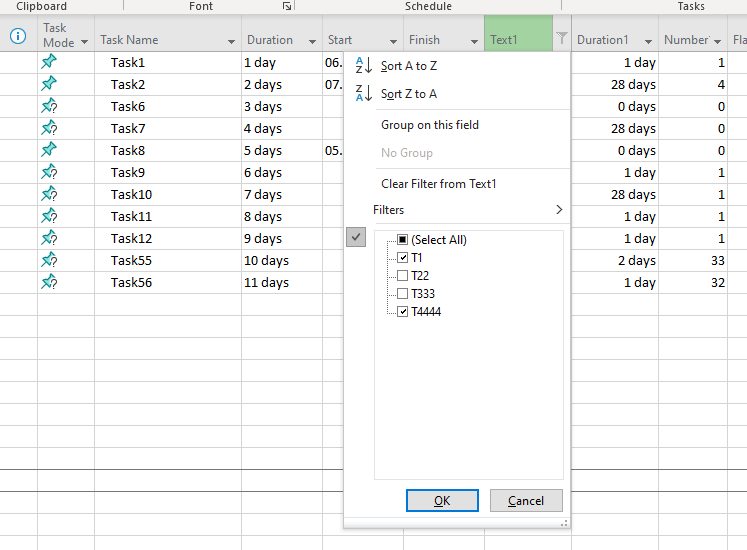

{}

This page contains release notes information for [Aspose.Tasks for Java 21.9](https://releases.aspose.com/tasks/java/new-releases/aspose.tasks-for-java-21.9/).

{}

## **All Changes**
|**Key**|**Summary**|**Issue Type**|
| :- | :- | :- |
| TASKSNET-10327 | Implement reading of AutoFilters with multiple values | Enhancement |
| TASKSNET-10307 | Fix "The given key '188744169' was not present in the dictionary." exception when open MPP document | Bug |
| TASKSNET-10306 | Fix "The given key '1680' was not present in the dictionary." exception when open document | Bug |
| TASKSNET-10303 | Fix StackOverflowException when creating a Project from Primavera XML | Bug |
| TASKSNET-10286 | Fix Aspose.Tasks Index was outside the bounds of the array | Bug |
| TASKSNET-10284 | Fix TotalSlack not returning the proper values | Bug |
| TASKSNET-10283 | Resource Over Allocation not updated for entire row | Bug |
| TASKSNET-4719 | IsOverallocated flag is True for tasks that are not overallocated for project plans  | Bug |

## **Public API and Backwards Incompatible Changes**
|**The following public enumerations were added:**|**Description**|
| :- | :- |
| com.aspose.tasks.FilterComparisonType.IsOneOf | The value of Field equals to one of the specified Values. Used in AutoFilters. |
| com.aspose.tasks.TaskKey.HasOverallocatedResource | Represents the HasOverallocatedResource (Task) field. |
| com.aspose.tasks.Tsk.HAS_OVERALLOCATED_RESOURCE | Indicates whether the task has an resource assigned which has more work on assigned tasks than can be completed within normal working capacity. |
## **Examples and additional notes**

**Related issue: TASKSNET-10327 - Implement reading of AutoFilters with multiple values**

FilterComparisonType.IsOneOf was added in order to represent auto filters which filter rows based on choices the user makes from a list of specific column's values in MS Project:


Project project = new Project("AutoFilters.mpp");
GanttChartView ganttView  = (GanttChartView)project.getViews().stream()
    .filter(v -> v.getScreen() == ViewScreen.Gantt)
    .findFirst()
    .orElseThrow(IllegalStateException::new);
Filter autoFilter = ganttView.getAutoFilters()
    .stream()
    .filter(a -> a.getCriteria().getField() == Field.TaskText1)
    .findFirst()
    .orElseThrow(IllegalStateException::new);
System.out.println(autoFilter.getCriteria().getTest());
System.out.printf(
    "%s,%s%n",
    autoFilter.getCriteria().getValues()[0],
    autoFilter.getCriteria().getValues()[1]
);
// The output is
// IsOneOf
// T1,T4444


**Related issue: TASKSNET-4719 - IsOverallocated flag is True for tasks that are not overallocated for project plans**

We added new task field Tsk.HAS_OVERALLOCATED_RESOURCE in order to make overallocations-related API more clear.
Sometimes a task can have overallocated resource, but task itself is not overallocated.
Consider the following figure:
Task1, Task2 have overallocated resource "Resource1", but Task1 and Task2 are not overallocated.

Task3 is overallocated because Resource3 have 9h work assigned on 3 August. Obviously, Task3 also has overallocated resource "Resource3".

Prior to 21.9 Aspose.Tasks for Java set Tsk.OVERALLOCATED for all that kinds of overallocation.
Now Aspose.Tasks for Java will set the properties in the following way for above-mentioned example:


task1.get(Tsk.HAS_OVERALLOCATED_RESOURCE) : true
task2.get(Tsk.HAS_OVERALLOCATED_RESOURCE) : true
task3.get(Tsk.HAS_OVERALLOCATED_RESOURCE) : true

task1.get(Tsk.IS_OVERALLOCATED) : false
task2.get(Tsk.IS_OVERALLOCATED) : false
task3.get(Tsk.IS_OVERALLOCATED) : true

resource1.get(Rsc.OVERALLOCATED) : true
resource2.get(Rsc.OVERALLOCATED) : false
resource3.get(Rsc.OVERALLOCATED) : true

