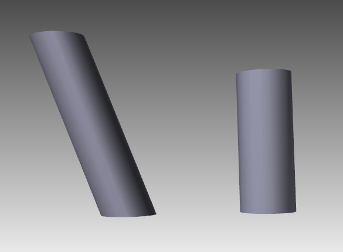
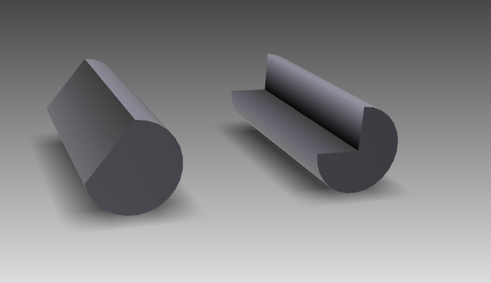
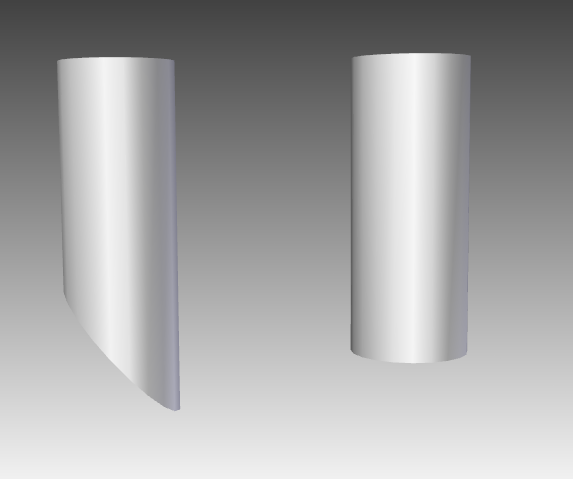

{} 

Esta página contiene notas de la versión para[Aspose.3D for .NET 19,6](https://www.nuget.org/packages/Aspose.3D/19.6.0)

{} 
## **Mejoras y cambios**

|**Clave**|**Resumen**|**Categoría**|
|:- |:- |:- |
|THREEDNET-511|Mejorar la creación de cilindro|Nueva característica|
|THREEDNET-507|Pierde algunos materiales al abrir el archivo RVM|Error|
|THREEDNET-508|El sistema puede no asignar el conjunto de descriptores a veces en Vulkan renderer|Error|
### **Público API y cambios incompatibles al revés**
Consulte la lista de cualquier cambio realizado al público API, como miembros agregados, renombrados, eliminados o obsoletados, así como cualquier cambio no compatible con versiones anteriores realizado a Aspose.3D for .NET. Si tiene inquietudes sobre cualquier cambio enumerado, por favor recújelo en el[Aspose.3D foro de apoyo](https://forum.aspose.com/c/3d).
#### **Añadido nueva propiedad OffsetTop en la clase Aspose.ThreeD. Entidades. Cilindro**


 /// 

/// Gets or sets the vertices transformation offset of the top side.

/// 

public Vector3 OffsetTop

{

    get;

    set;

}


#### **Añadido nueva propiedad OffsetBottom en la clase Aspose.ThreeD. Entidades. Cilindro**


 /// 

/// Gets or sets the vertices transformation offset of the bottom side.

/// 

public Vector3 OffsetBottom

{

    get;

    set;

}



Código de muestra para generar un cilindro con OffsetTop personalizado:



 Scene scene = new Scene();

var fan = new Cylinder(2, 2, 10, 20, 1, false);

fan.OffsetTop = new Vector3(5, 3, 0);

scene.RootNode.CreateChildNode(fan).Transform.Translation = new Vector3(10, 0, 0);

var nonfan = new Cylinder(2, 2, 10, 20, 1, false);

scene.RootNode.CreateChildNode(nonfan);

scene.Save("test.obj", FileFormat.WavefrontOBJ);



Vista previa:

La izquierda tiene**Offset Top**Establecido en (5, 3, 0), es fácil ver que la tapa superior se ha movido y todo el torso también se ve afectado.
#### **Añadido nueva propiedad GenerateFanCylinder en la clase Aspose.ThreeD. Entidades. Cilindro**


 /// 

/// Gets or sets whether to generate the fan-style cylinder when the ThetaLength is less than 2*PI, otherwise the model will not be cut.

/// 

public bool GenerateFanCylinder

{

    get;set;

}



Código de muestra para generar un cilindro estilo ventilador y un cilindro sin ventilador:



 Scene scene = new Scene();

var fan = new Cylinder(2, 2, 10, 20, 1, false);

fan.GenerateFanCylinder = true;

fan.ThetaLength = MathUtils.ToRadian(270);

scene.RootNode.CreateChildNode(fan).Transform.Translation = new Vector3(10, 0, 0);

var nonfan = new Cylinder(2, 2, 10, 20, 1, false);

nonfan.GenerateFanCylinder = false;

nonfan.ThetaLength = MathUtils.ToRadian(270);

scene.RootNode.CreateChildNode(nonfan);

scene.Save("test.obj", FileFormat.WavefrontOBJ);



Vista previa:

El cilindro izquierdo tiene GenerateFanCylinder = falso y el derecho tiene GenerateFanCylinder = true.
#### **Añadido nueva propiedad ShearTop en la clase Aspose.ThreeD. Entidades. Cilindro**


 /// 

/// Gets or sets of the shear transform of the top side, vector stores the (x-axis, z-axis) shear value that measured in radian, default value is (0, 0)

/// 

public Vector2 ShearTop

{

    get;

    set;

}


#### **Añadido nueva propiedad ShearBottom en la clase Aspose.ThreeD. Entidades. Cilindro**


 /// 

/// Gets or sets of the shear transform of the bottom side, vector stores the (x-axis, z-axis) shear value that measured in radian, default value is (0, 0)

/// 

public Vector2 ShearBottom

{

    get;

    set;

}



Código de muestra para mostrar el uso de ShearBottom(ShearTop):



 Scene scene = new Scene();

var cylinder1 = new Cylinder(2, 2, 10, 20, 1, false);

cylinder1.ShearBottom = new Vector2(0, 0.83);// shear 47.5deg in xy plane(z-axis)

scene.RootNode.CreateChildNode(cylinder1).Transform.Translation = new Vector3(10, 0, 0);

var cylinder2 = new Cylinder(2, 2, 10, 20, 1, false);

scene.RootNode.CreateChildNode(cylinder2);

scene.Save("test.obj", FileFormat.WavefrontOBJ);



Vista previa:

El cilindro izquierdo tiene ShearBottom a (0, 0,83) mientras que el derecho es un cilindro ordinal.
