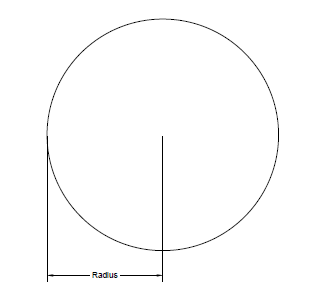
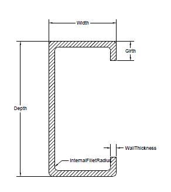
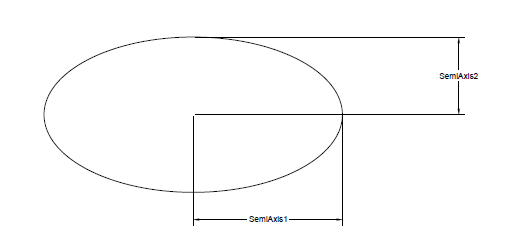
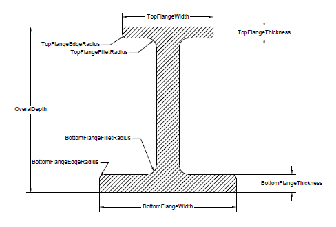
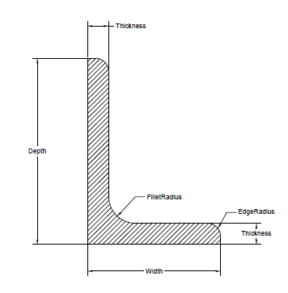
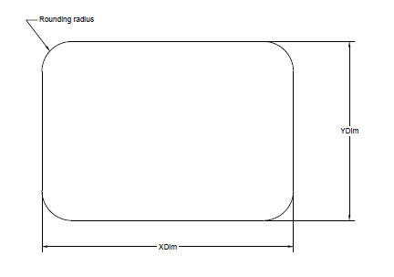
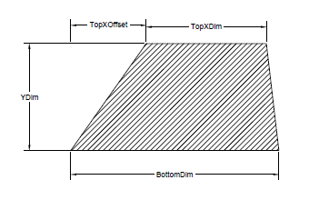
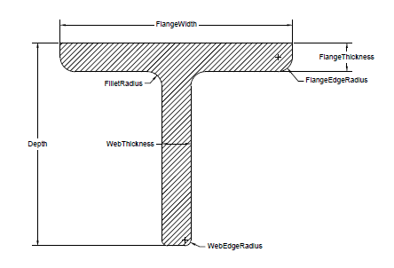
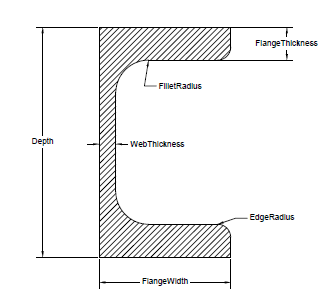
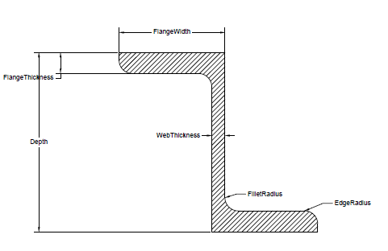

{} 

Esta página contiene notas de información de la versión Aspose.3D for .NET 20,2

{} 
## **Mejoras y cambios**

|**Clave**|**Resumen**|**Categoría**|
|:- |:- |:- |
|THREEDNET-612 |` `IFC, generación de forma I de procedimiento compatible|` ` Nueva característica|
|THREEDNET-615 |` `IFC procesal compatible con generación de forma C|` ` Nueva característica|
|THREEDNET-616 |` `IFC compatible con generación de forma Z de procedimiento|` ` Nueva característica|
|THREEDNET-617 |` `IFC compatible con generación de forma L de procedimiento|` ` Nueva característica|
|THREEDNET-618 |` `IFC compatible con la generación de forma T de procedimiento|` ` Nueva característica|
|THREEDNET-619 |` `IFC, generación de forma en U de procedimiento compatible|` ` Nueva característica|
|THREEDNET-620 |` `IFC, generación de forma de rectángulo de procedimiento compatible|` ` Nueva característica|
|THREEDNET-625 |` `IFC, generación de forma de círculo de procedimiento compatible|` ` Nueva característica|
|THREEDNET-626 |` `IFC, generación de forma de elipse de procedimiento compatible|` ` Nueva característica|
|THREEDNET-558 |` `Add soporte de representación de transparencia en el renderizador web|` ` Mejora|
|THREEDNET-606 |` ` Cuadro delimitador de visualización si se selecciona el nodo en el navegador de activos.|` ` Mejora|
|THREEDNET-613 |` `Añadir el soporte de renderizado de la forma|` ` Mejora|
|THREEDNET-630 |` ` El proceso se cuelga al cargar archivos RVM|` `Bug|
|THREEDNET-632 |` ` Excepción sobre la carga del archivo FBX|` `Bug|
|THREEDNET-629 |` ` Excepción sobre la conversión GLB a 3d|` `Bug|
|THREEDNET-623 |` ` La GPU del Intel no es compatible con el renderizador Aspose.3D|` `Bug|
|THREEDNET-628 |` ` Excepción sobre la carga del archivo FBX|` `Bug|
## **Cambios públicos API y atrasados incompatibles**
### **Añadido nueva clase Aspose.ThreeD. Perfiles. Perfil**
Esta clase es la clase base de todos los perfiles, que se puede utilizar para crear mallas parametrizadas. Una clase de perfil representa un perfil 2D en el plano x-y.



     /// 

    /// 2D Profile in xy plane

    /// 

    public abstract class Profile : Entity

    {

        /// 

        /// Gets the extent in x and y dimension.

        /// 

        /// <returns></returns>

        public abstract Vector2 GetExtent();

    }

    /// 

    /// The base class of all parameterized profiles.

    /// 

    public abstract class ParameterizedProfile : Profile

    {

    }



Toda la subclase de perfil se puede convertir a malla 3D a través de LinearExtrusion como se muestra en el siguiente código de muestra:



 var mesh = new LinearExtrusion(new LShape()

    {

     FilletRadius = 1,

     Width = 4,

     Depth = 7

      }, 1);

Scene s = new Scene(mesh);

s.Save(@"LShape.obj", FileFormat.WavefrontOBJ);


### **Añadido nueva clase Aspose.ThreeD. Perfiles. CircleShape**
Las propiedades de CircleShape se pueden ilustrar en la siguiente figura.

### **Añadido nueva clase Aspose.ThreeD. Perfiles. CShape**
Las propiedades de CShape se pueden ilustrar en la siguiente figura:

### **Añadido nueva clase Aspose.ThreeD. Perfiles. ElipseShape**
Propiedades de ElipseShape se pueden ilustrar en esta figura:

### **Añadido nueva clase Aspose.ThreeD. Perfiles. HShape**
Las propiedades de HShape se pueden ilustrar en esta figura:

### **Añadido nueva clase Aspose.ThreeD. Perfiles. LShape**
Las propiedades de LShape se pueden ilustrar en esta figura:

### **Añadido nueva clase Aspose.ThreeD. Perfiles. RectangleShape**
Las propiedades de RectangleShape se pueden ilustrar en esta figura:

### **Añadido nueva clase Aspose.ThreeD. Perfiles. TrapeziumShape**
Las propiedades de TrapeziumShape se pueden ilustrar en esta figura:

### **Añadido nueva clase Aspose.ThreeD. Perfiles. TShape**
Las propiedades de TShape se pueden ilustrar en la siguiente figura:

### **Añadido nueva clase Aspose.ThreeD. Perfiles. UShape**
Las propiedades de UShape se pueden ilustrar en la siguiente figura:

### **Añadido nueva clase Aspose.ThreeD. Perfiles. ZShape**
Las propiedades de ZShape se pueden ilustrar en la siguiente figura.

### **Añadido nueva clase Aspose.ThreeD. Perfiles. Forma de espejo**
Este perfil define un nuevo perfil reflejando el perfil base sobre el eje y.



 var mesh = new LinearExtrusion(new MirroredProfile(new LShape()

            {

                FilletRadius = 1,

                Width = 4,

                Depth = 7

            }), 1);

Scene s = new Scene(mesh);

s.Save(@"MirroredLShape.obj", FileFormat.WavefrontOBJ);



