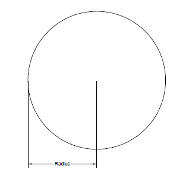
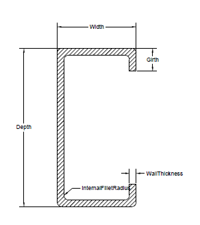
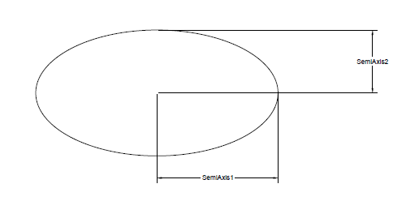
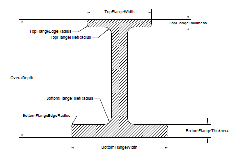
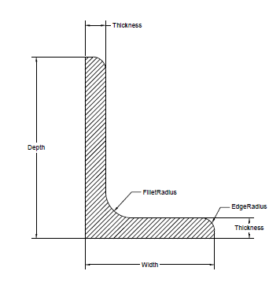
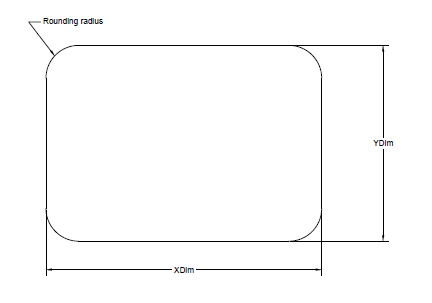
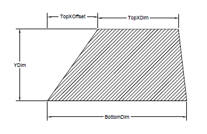
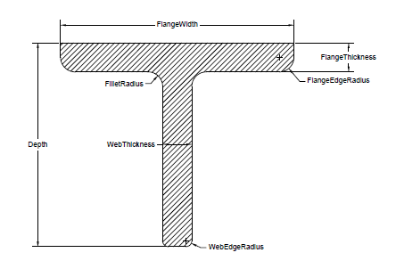
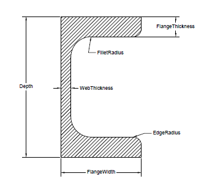
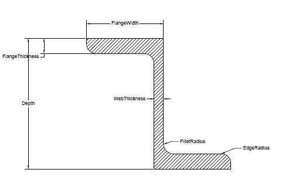

{} 

Cette page contient les notes de sortie pour Aspose.3D for Java 20.2.

{} 

|**Clé**|**Résumé**|**Catégorie**|
|:- |:- |:- |
|THREEDNET-612 |` `IFC compatible procédure je forme génération|` `Nouvelle fonctionnalité|
|THREEDNET-615 |Génération de forme C procédurale compatible ` `IFC|` `Nouvelle fonctionnalité|
|THREEDNET-616 |Génération de forme Z procédurale compatible ` `IFC|` `Nouvelle fonctionnalité|
|THREEDNET-617 |Génération de forme L procédurale compatible ` `IFC|` `Nouvelle fonctionnalité|
|THREEDNET-618 |Génération de forme en T procédurale compatible ` `IFC|` `Nouvelle fonctionnalité|
|THREEDNET-619 |Génération de forme en U procédurale compatible ` `IFC|` `Nouvelle fonctionnalité|
|THREEDNET-620 |Génération de forme de rectangle procédurale compatible ` `IFC|` `Nouvelle fonctionnalité|
|THREEDNET-625 |Génération de forme de cercle procédural compatible ` `IFC|` `Nouvelle fonctionnalité|
|THREEDNET-626 |Génération de forme d'ellipse procédurale compatible ` `IFC|` `Nouvelle fonctionnalité|
|THREEDNET-558 |` `Ajouter la prise en charge du rendu de transparence dans le rendu Web|Amélioration ` `|
|THREEDNET-606 |` ` Boîte de connexion d'affichage si le nœud est sélectionné dans le navigateur Asset.|Amélioration ` `|
|THREEDNET-613 |` `Ajouter le support de rendu de la forme|Amélioration ` `|
|THREEDNET-630 |Le processus ` ` se bloque lors du chargement des fichiers RVM|` `Bug|
|THREEDNET-632 |` `Exception sur le chargement du fichier FBX|` `Bug|
|THREEDNET-629 |` `Exception sur la conversion de GLB en 3d|` `Bug|
|THREEDNET-623 |Le GPU de ` `Intelest pas pris en charge par le moteur de rendu Aspose.3D|` `Bug|
|THREEDNET-628 |` `Exception sur le chargement du fichier FBX|` `Bug|
## **Public API et changements incompatibles vers l'arrière**
### **Ajouté nouvelle classe Aspose.ThreeD. Profils. Profil**
Cette classe est la classe de base de tous les profils, qui peut être utilisée pour créer des maillages paramétrés. Une classe de profil représente un profil 2D dans le plan x-y.



  /**

 * 2D Profile in xy plane

 */

public abstract class Profile extends Entity

{

    /**

     * Gets the extent in x and y dimension.

     */

    public abstract Vector2 getExtent();

}

/**

 * The base class of all parameterized profiles.

 */

public abstract class ParameterizedProfile extends Profile

{

}



Toute la sous-classe de profil peut être convertie en maillage 3D via LinearExtrusion comme indiqué dans l'exemple de code suivant:



 LShape baseShape = new LShape();

baseShape.setFilletRadius(1);

baseShape.setWidth(4);

baseShape.setDepth(7);

LinearExtrusion mesh = new LinearExtrusion(baseShape, 1);

Scene s = new Scene(mesh);

s.save("MirroredLShape.obj", FileFormat.WAVEFRONTOBJ);


### **Ajout d'une nouvelle classe com.aspose. trois. CircleShape**
Les propriétés de CircleShape peuvent être illustrées dans la figure ci-dessous.

### **Ajout d'une nouvelle classe com.aspose. trois. CShape**
Les propriétés de CShape peuvent être illustrées dans la figure ci-dessous:

### **Ajout d'une nouvelle classe com.aspose. trois. EllipseShape**
Les propriétés d'EllipseShape peuvent être illustrées dans cette figure:

### **Ajout d'une nouvelle classe com.aspose. trois. HShape**
Les propriétés de HShape peuvent être illustrées dans cette figure:

### **Ajout d'une nouvelle classe com.aspose.threed.LShape**
Les propriétés de LShape peuvent être illustrées dans cette figure:

### **Ajout d'une nouvelle classe com.aspose. trois. RectangleShape**
Les propriétés de RectangleShape peuvent être illustrées dans cette figure:

### **Ajout d'une nouvelle classe com.aspose. trois. TrapeziumShape**
Les propriétés de TrapeziumShape peuvent être illustrées dans cette figure:

### **Ajout d'une nouvelle classe com.aspose.threed.TShape**
Les propriétés de TShape peuvent être illustrées dans la figure ci-dessous:

### **Ajout d'une nouvelle classe com.aspose.threed.UShape**
Les propriétés de UShape peuvent être illustrées dans la figure suivante:

### **Ajout d'une nouvelle classe com.aspose. trois. ZShape**
Les propriétés de ZShape peuvent être illustrées dans la figure suivante.

### **Ajout d'une nouvelle classe com.aspose. trois. MirroredShape**
Ce profil définit un nouveau profil en mettant en miroir le profil de base sur l'axe y.



 LShape baseShape = new LShape();

baseShape.setFilletRadius(1);

baseShape.setWidth(4);

baseShape.setDepth(7);

LinearExtrusion mesh = new LinearExtrusion(new MirroredProfile(baseShape), 1);

Scene s = new Scene(mesh);

s.save("MirroredLShape.obj", FileFormat.WAVEFRONTOBJ);


